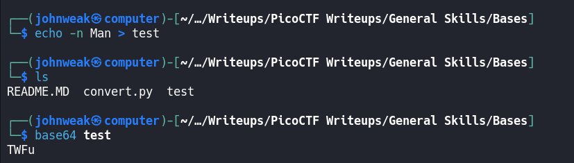
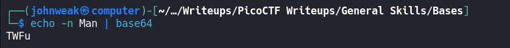
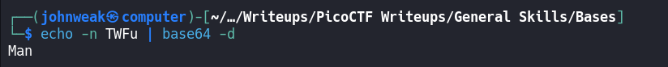
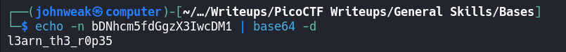

# Bases

## Overview

**Points:** 100\
**Tags:** General Skills

## Description

What does this `bDNhcm5fdGgzX3IwcDM1` mean? I think it has something to do with bases.

## Hints

1. Submit your answer in our flag format. For example, if your answer was 'hello', you would submit 'picoCTF{hello}' as the flag.

## Approach

Because it's the basic, i'm gonna talk to you that this string is on `base64`.

> `Base64` is an encoding scheme used to represent binary data in an ASCII string format. It's commonly used to encode data that needs to be stored and transferred over media that are designed to handle textual data. This includes encoding binary data into text for embedding in HTML, CSS, JSON and other text-based formats.

> How `base64` works? `base64` encodes binary data by dividing the input into groups of 3 bytes (24 bits). Each 24-bit group is divided into 4 group of 6 bits. And each of 6-bit groups is mapped to a character in the `BASE64` alphabet.

> Base64 alphabet consists of 64 cahracters:
> `A-Z, a-z, 0-9, +, /` and an additional character `=` is used for padding if necessary.

> Padding if the total number of input bytes is not divisible by 3. Padding are added to the output to make the length of encoded output a multiple of 4.

Let's say we want to encode the string `Man`:
1. ASCII to Binary:
    - 'M' = 01001101
    - 'a' = 01100001
    - 'n' = 01101110
2. Combine the binary data, we have: 01001101 01100001 01101110
3. Divide into 6-bit groups:\
010011 010110 000101 101110
4. Map to Base64 alphabet:
    - 010011(2) = 19(10) = T
    - 010110(2) = 22(10) = W
    - 000101(2) = 5(10) = F
    - 101110(2) = 46(10) = u
So, the result of encoding "Man" is "TWFu"
5. Because `len("TWFu) % 4 == 0`, we don't need to add any `=` more at the end. You could see that by notice the size of string `Man` (3 bytes % 3 == 0)

Oke, back to our challenge, there is a command-line utility in Linux helping you to encode and decode data using the Base64 encoding scheme.

It's called `base64`, we can try it:

It's usually used in a pipe, like:

And decoding:

So in this challenge, we do the bellow:

Now copy the flag and answer your question.
## Flag

`picoCTF{l3arn_th3_r0p35}`