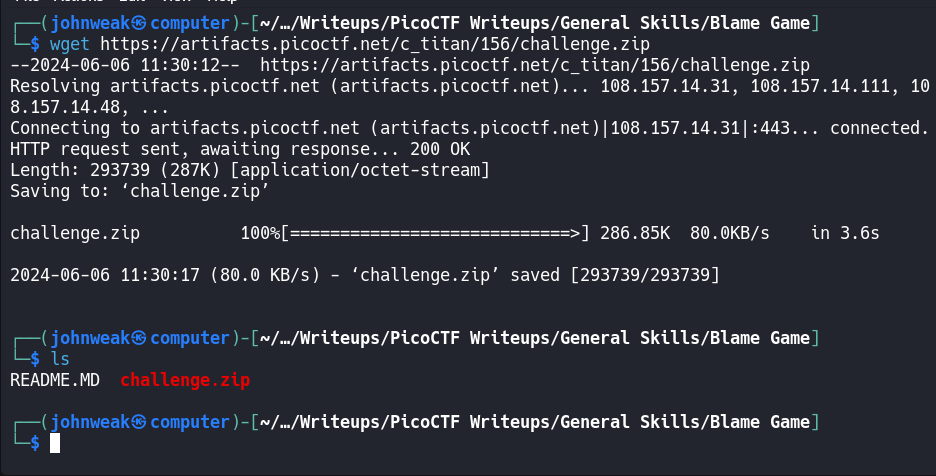
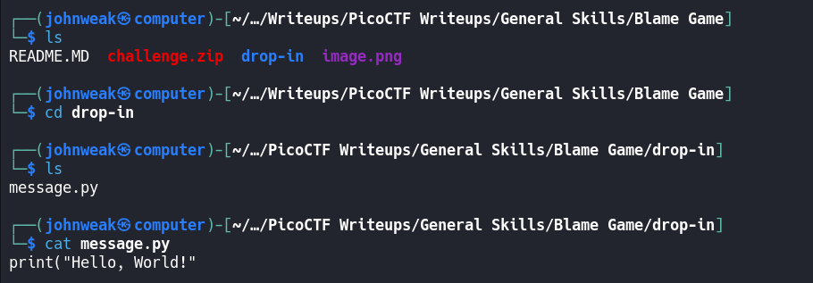
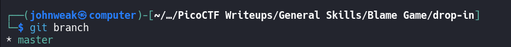
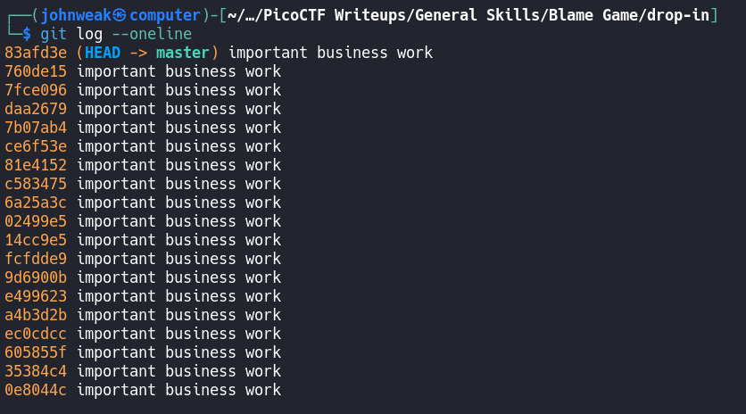
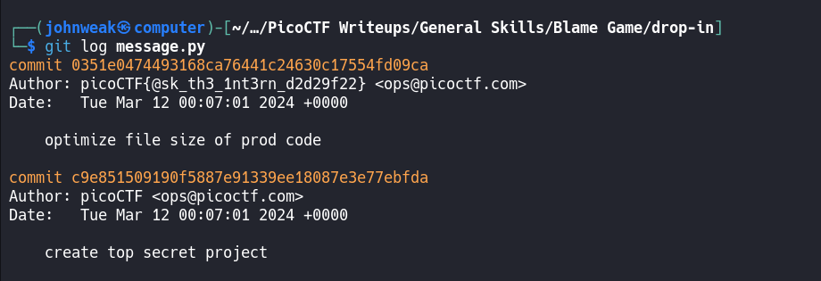
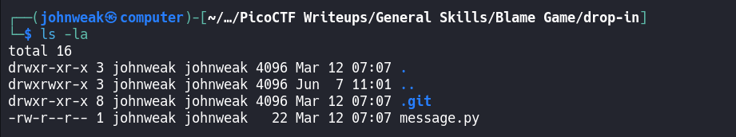
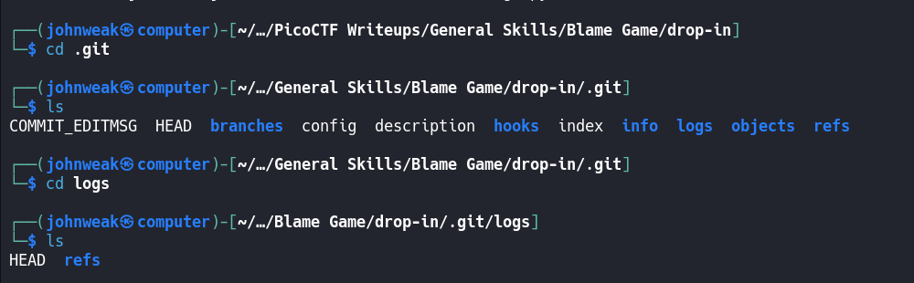
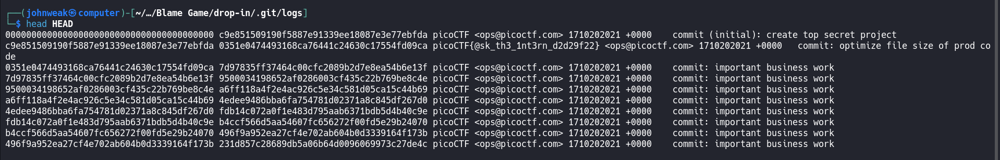
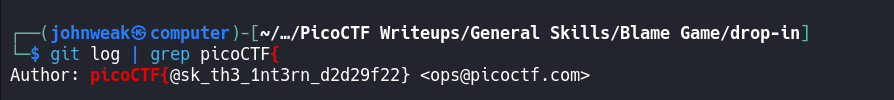

# Blame Game

## Overview

**Points:** 75\
**Tags:** General Skills, browser_webshell_solvable, git

## Description

Someone's commits seems to be preventing the program from working. Who is it?\
You can download the challenge files here:
- [challenge.zip](./challenge.zip)

## Hints

1. In collaborative projects, many users can make many changes. How can you see the changes within one file?
2. Read the chapter on Git from the picoPrimer [here](https://primer.picoctf.org/#_git_version_control)
3. You can use `python3 <file>.py` to try running the code, though you won't need to for this challenge.

## Approach

Did you get the zip archive?

`unzip` to extract it, we have a directory named `drop-in`, take a look at it:

Stupid stuff!
Because this challenge suggested about someone's commits, we should take a look at `git branch`

Maybe `git log --oneline`

ukm, i can get the details: `git log`, but i wanna show you this:
Because there could be many changes accross the project you can use the command on one specified file. In this case, it's `git log message.py`

Oke, we've done successfully!

## Flag

`picoCTF{@sk_th3_1nt3rn_d2d29f22}`

## Alternative Approach

### way 1
Because all information about git repository is stored in `.git` directory, we can look for the flag inside it. Let's try:

We always have directory name `.git` on my local repository. Just go ahead:

Now i'm inside the `logs` directory, all their commits were stored on `HEAD` file and the `refs` directory contains all the activities on remote repo. But everythings will be sorted in order of older first here.

Oke, let check the file named `HEAD` here, i will use the command named `head` to show the first 10 lines of it.

See the flag? 

### way 2
Simply, you can combine `git log` with a filter tool in a pipe:

Easy! 

But the purpose of this challenge isn't this thing.