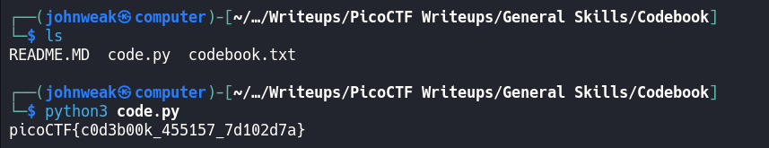
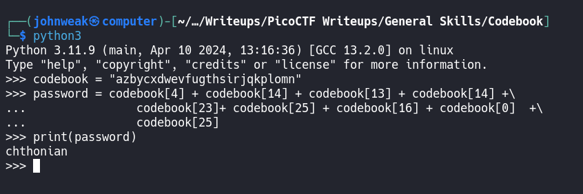
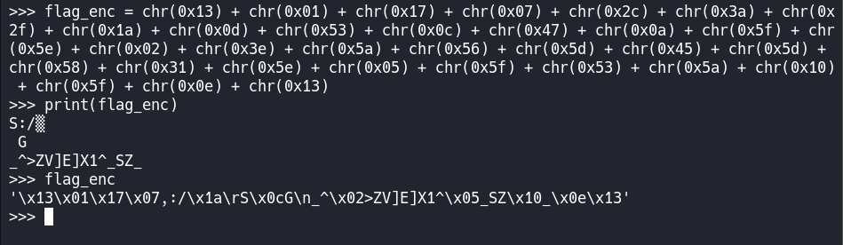

# Codebook

## Overview

**Points:** 100\
**Tags:** Beginner picoMini 2022, General Skills, shell, Python

## Description

Run the Python script `code.py` in the same directory as `codebook.txt`.
- [Download code.py](./code.py)
- [Download codebook.txt](./codebook.txt)

## Hints

1. On the webshell, use `ls` to see if both files are in the directory you are in
2. The `str_xor` function does not need to be reverse engineered for this challenge.

## Approach

In this challenge, we just need to run the Python script `code.py` in the same directory as `codebook.txt`



So easy right? But I'm currently curious that how it works. Let's take a look at the python script.

```python

import random
import sys


def str_xor(secret, key):
    #extend key to secret length
    new_key = key
    i = 0
    while len(new_key) < len(secret):
        new_key = new_key + key[i]
        i = (i + 1) % len(key)        
    return "".join([chr(ord(secret_c) ^ ord(new_key_c)) for (secret_c,new_key_c) in zip(secret,new_key)])


flag_enc = chr(0x13) + chr(0x01) + chr(0x17) + chr(0x07) + chr(0x2c) + chr(0x3a) + chr(0x2f) + chr(0x1a) + chr(0x0d) + chr(0x53) + chr(0x0c) + chr(0x47) + chr(0x0a) + chr(0x5f) + chr(0x5e) + chr(0x02) + chr(0x3e) + chr(0x5a) + chr(0x56) + chr(0x5d) + chr(0x45) + chr(0x5d) + chr(0x58) + chr(0x31) + chr(0x5e) + chr(0x05) + chr(0x5f) + chr(0x53) + chr(0x5a) + chr(0x10) + chr(0x5f) + chr(0x0e) + chr(0x13)


def print_flag():
  try:
    codebook = open('codebook.txt', 'r').read()
    
    password = codebook[4] + codebook[14] + codebook[13] + codebook[14] +\
               codebook[23]+ codebook[25] + codebook[16] + codebook[0]  +\
               codebook[25]
               
    flag = str_xor(flag_enc, password)
    print(flag)
  except FileNotFoundError:
    print('Couldn\'t find codebook.txt. Did you download that file into the same directory as this script?')


def main():
  print_flag()


if __name__ == "__main__":
  main()

```

Ukm, We can see that the flag is encrypted with a password. Can you get the password now? try it:



So the password we've found is `chthonian`.\
How about the `flag_enc`



It's not readable string.

The way that the flag is decrypted is by using the `str_xor` function. The `str_xor` function takes in 2 strings and returns the xor of the 2 strings. First it extends the `password` to the length of the `flag_enc`, then it returns the xor of the 2 strings.

And that is how we get the flag. Maybe you wanna know more about `Verginere` cipher.

## Flag

`picoCTF{c0d3b00k_455157_7d102d7a}`
