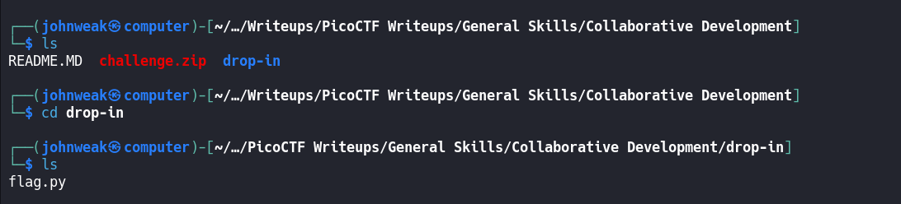
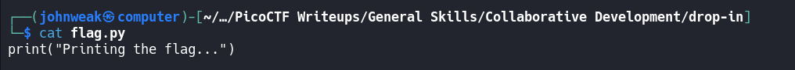
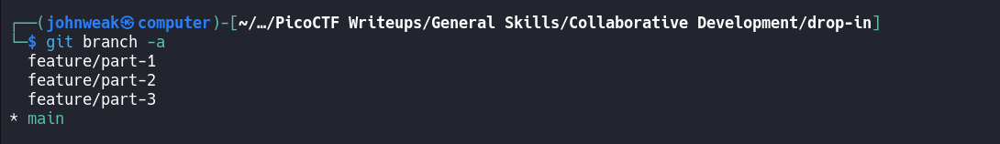
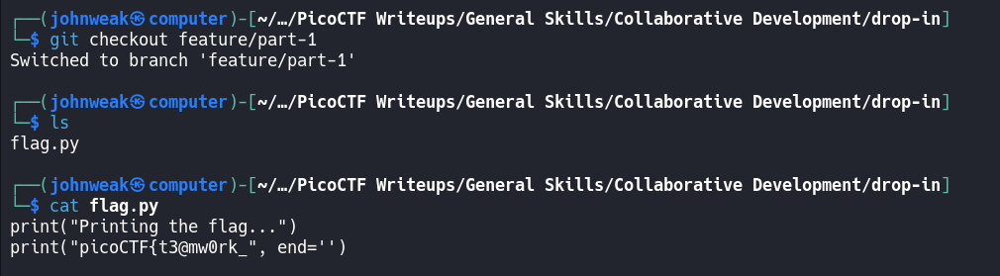
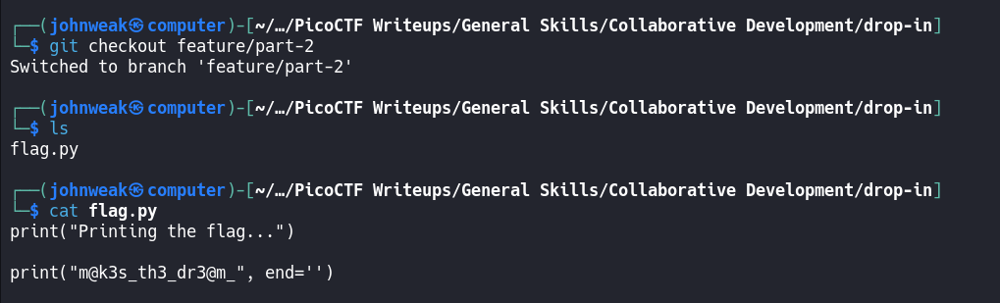
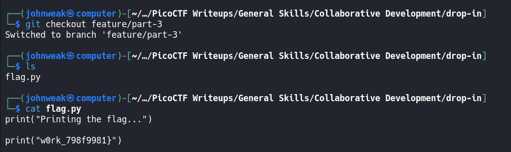

# Collaborative Development

## Overview 

**Points:** 75\
**Tags:** General Skills, browser_webshell_solvable, git

## Description

My team has been working very hard on new features for our flag printing program! I wonder how they'll work together?\
You can download the challenge files here:
- [challenge.zip](./challenge.zip)

## Hints

1. git branch -a will let you see available branches
2. How can file `diffs` be brought to the main branch? Don't forget to git config!
3. Merge conflicts can be tricky! Try a text editor like nano, emacs, or vim.

## Approach

As our previous challenges, get the zip file, extract and explore it.

Oke we're here inside the `drop-in` directory after unzip the `challenge`

This is content of `flag.py`.

When you colab with others through `github`, you usually create many `branch` as the individual development space or in order to develop specific features. We should check it:

There are 3 branchs to develop 3 features and a `main` branch as the office branch.
We are in branch `main`, we can `git checkout` to other branches. Try doing this:

Oke, we have the first part of the flag. Continue to checkout another:

Maybe the second. Go ahead to the rest:

And we have the final.\
Right now just combine these things.

## Flag

`picoCTF{t3@mw0rk_m@k3s_th3_dr3@m_w0rk_798f9981}`

