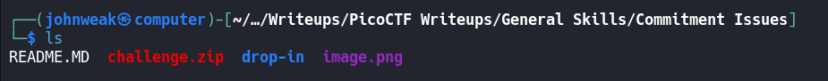
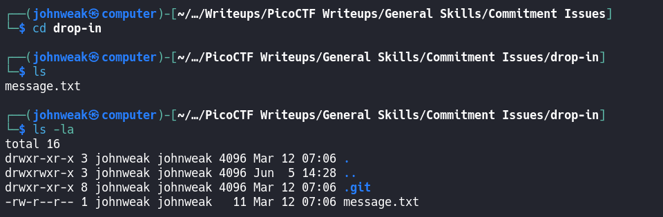
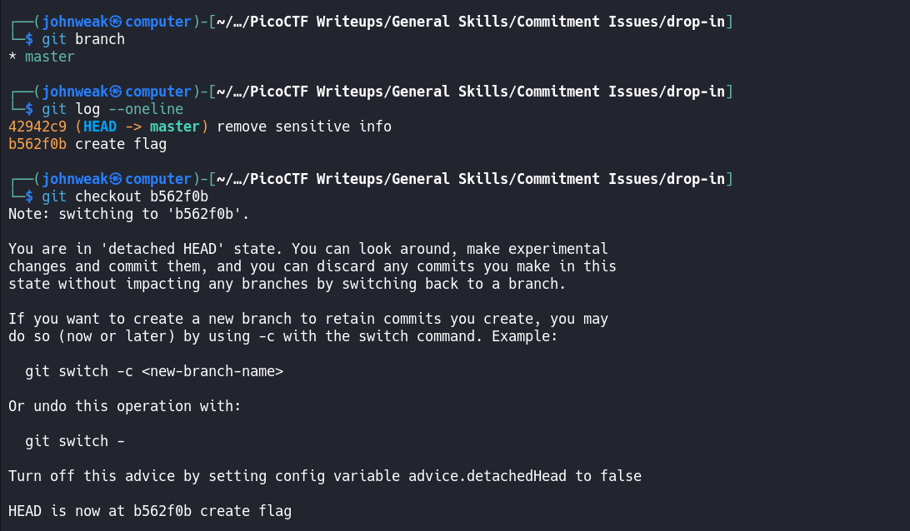
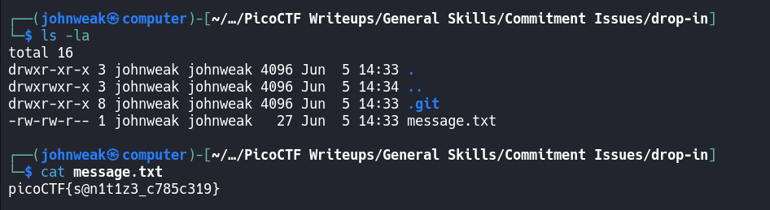

# Commitment Issues

## Overview

**Points:** 50\
**Tags:** General Skills, browser_webshell_solvable, git

## Description

I accidentally wrote the flag down. Good thing I deleted it! You download the challenge files here:
- [challenge.zip](./challenge.zip)

## Hints

1. Version control can help you recover files if you change or lose them!
2. Read the chapter on Git from the picoPrimer [here](https://primer.picoctf.org/#_git_version_control)
3. You can 'checkout' commits to see the files inside them

## Approach

Get the file `challenge.zip` from that link:
```bash
$ wget https://artifacts.picoctf.net/c_titan/138/challenge.zip
```
Oke, it's a zip archive. Let's go ahead and see what things are inside it:
```bash
$ unzip -l challenge.zip
```
Ops, there're many stuff inside a directory named `drop-in`, so just unzip it 
```bash
$ unzip challenge.zip
```
And we've got `drop-in` already.

Continue to explore:

oh, there is a hidden file named `.git`. It means that there is a git repository here.\
Let's check:

I've checked out to commit `create flag` with hash code `b562f0b`
See if something are there:

Oke, we got the flag in `message.txt`

## Flag

`picoCTF{s@n1t1z3_c785c319}`

