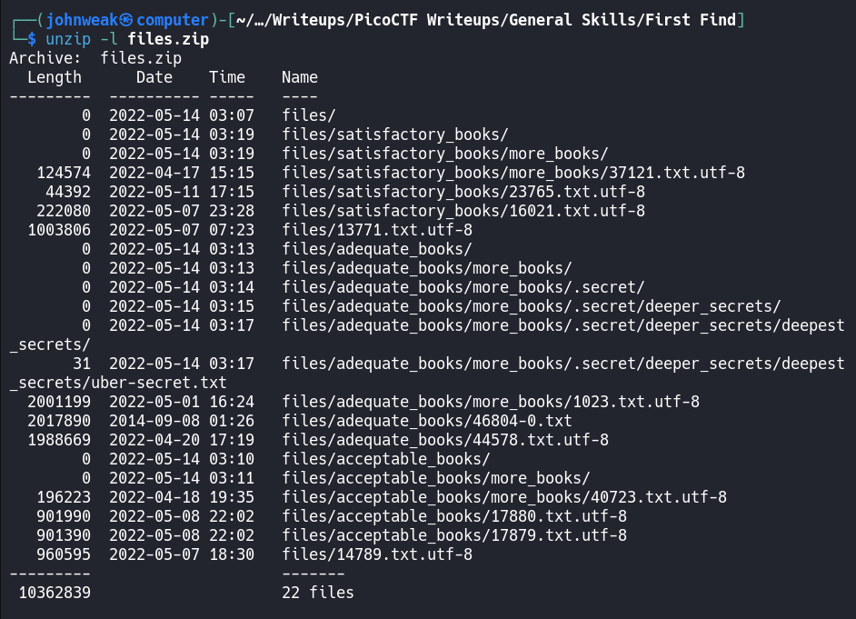
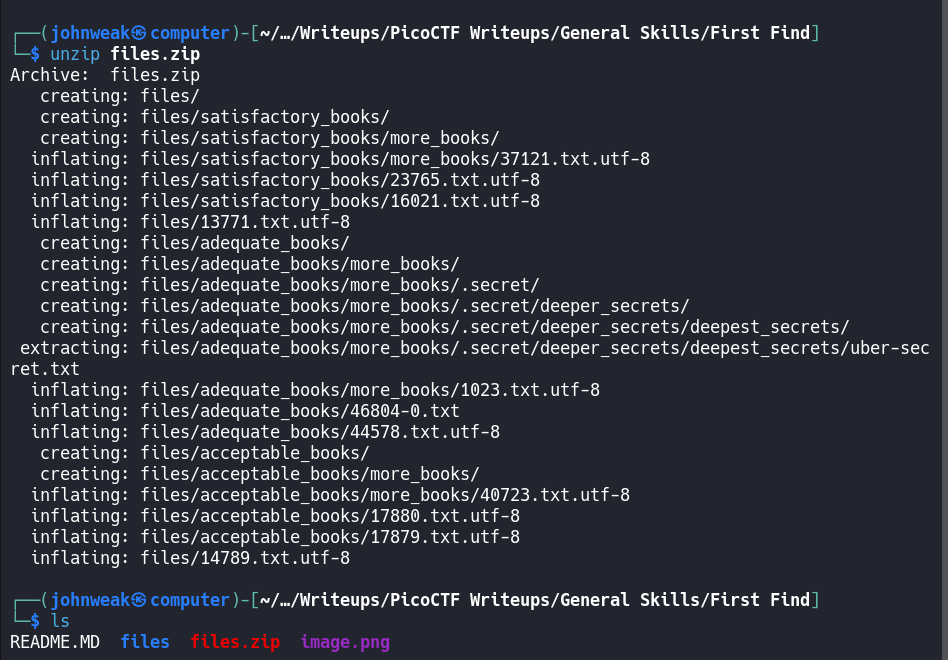
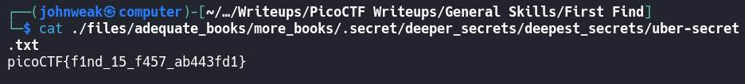
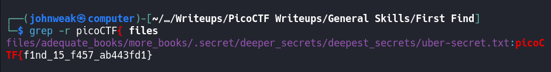

# First Find

## Overview

**Points:** 100\
**Tags:** General Skills

## Description

Unzip this archive and find the file named 'uber-secret.txt'\
- [Download zip file](./files.zip)

## Hints

(none)

## Approach

Download the archive by `wget` and then see what's on this zip file:


Oke, there are a lot of things in a directory named `files`. Now we will `unzip` it.


We already have directory named `files`. How do we find the file named `uber-secret.txt`?

If you have the name of file that need to be found, you can use a tool name `find`. 

See the `man page` of `find` command:
```bash
$ man find
```

Oke, below is what we're gonna do:
```bash
$ find ./files -name uber-secret.txt
```

And the result is:


Let's see if something's there:



the flag!!

## Flag

`picoCTF{f1nd_15_f457_ab443fd1}`

## Alternative Approach

You know for sure that the flag is in the directory name `files`, you can use `grep -r` command to seach the pattern `picoCTF{` in this directory.

