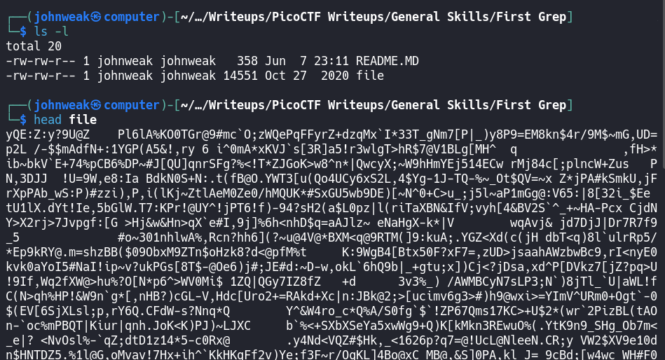

# First Grep

## Overview

**Points:** 100\
**Tags:** General Skills

## Description

Can you find the flag in [file](./file)? This would be really tedious to look through manually, something tells me there is a better way.

## Hints

1. grep [tutorial](https://ryanstutorials.net/linuxtutorial/grep.php)

## Approach
Get the file first and check it:

Shit!! We need to look for the flag on this file. It will take you a long time if you do it manually. We can use a tool named `grep`:

here it is!
## Flag

`picoCTF{grep_is_good_to_find_things_dba08a45}`
