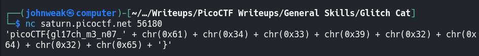
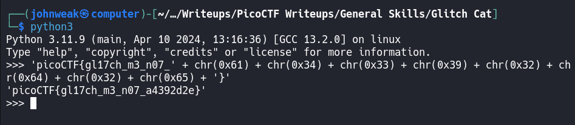

# Glitch Cat

## Overview

**Points:** 100\
**Tags:** General Skills, nc, shell, Python

## Description

Our flag printing service has started glitching!\
Additional details will be available after launching your challenge instance.

## Hints

1. ASCII is one of the most common encodings used in programming
2. We know that the glitch output is valid Python somehow!
3. Press Ctrl + C on your keyboard to close your connection and return to the command prompt.

## Approach

Do you remember how to use `nc` as a client?\
```bash
$ nc saturn.picoctf.net 56180
```

After connecting to server, we receive the bellow:


We all know that it's the ASCII code in hex. So i can use Python to print it out.


It's so easy right?

## Flag

`picoCTF{gl17ch_m3_n07_a4392d2e}`
