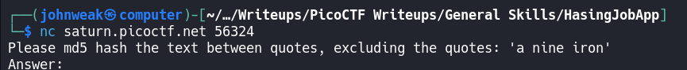
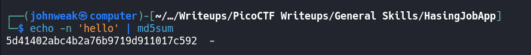
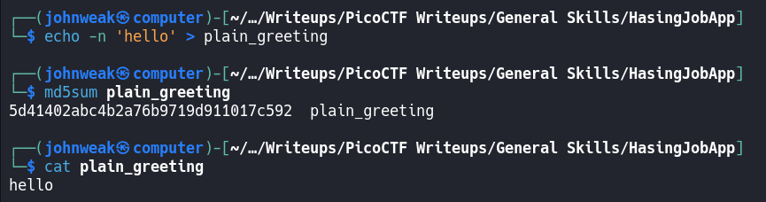
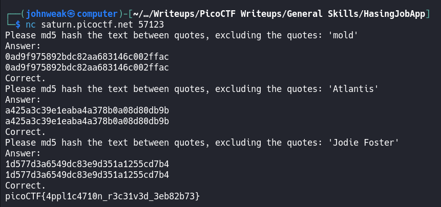
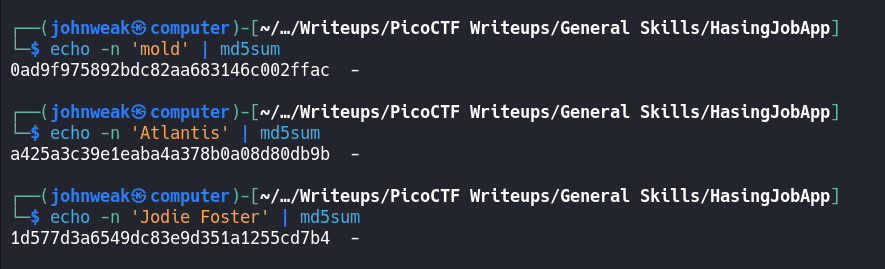

# HashingJobApp

## Overview

**Points:** 100\
**Tags:** General Skills, hasing, nc, shell, Python

## Description

If you want to hash with the best, beat this test!\
Additional details will be available after launching your challenge instance.

## Hints

1. You can use a commandline tool or web app to hash text
2. Press Ctrl + C on your keyboard to close your connection and return to the command prompt.

## Approach

Firstly, connect to the server using `nc`
```bash
$ nc saturn.picoctf.net <port>
```



Oke, the challenge ask us to hash a text by md5 hashcode. Do you know md5 hash?

> MD5 (message digest algorithm 5) is a widely used cryptographic hash function that produces a 128-bit (16-byte) hash value, typically expressed as a 32-character hexadecimal number. Input can be any length of data and output always is a 128-bit hash value (32-character). It is often used to verify data integrity.

> In Linux, there is a tool that is able to generate md5 hash named `md5sum`. Let's take a look:
> - For a string:
>
> 
>
> - For a file:
>
> 

> MD5 hashes are designed to be one-way functions, meaning that they cannot be reversed or "decoded" to retrieve the original input.
> However, there are some methods and tools that can be used to find the original input if certain conditions are met:
> 1. Brute force attack
> 2. rainbow attack
> 3. online md5 lookup tools

> For security purposes, it is advisable to use stronger hash functions like `SHA-256` and to use `salting` to enhance security.

Oke, back to the challenge, i will use a commandline tool named `md5sum` to solve it. Let's check it:

 



Just open 2 commandline, copy and paste with each other and done!

## Flag

`picoCTF{4ppl1c4710n_r3c31v3d_3eb82b73}`
