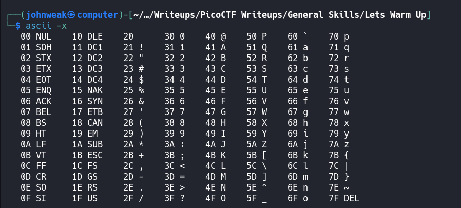

# Lets Warm Up

## Overview

**Points:** 50\
**Tags:** General Skills

## Description

If I told you a word started with 0x70 in hexadecimal, what would it start with in ASCII?

## Hints

1. Submit your answer in our flag format. For example, if your answer was 'hello', you would submig 'picoCTF{hello}' as the flag.

## Approach

Too easy to guess, let's look for it in ASCII table

Is it `p`?

## Flag

`picoCTF{p}`