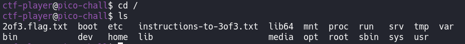
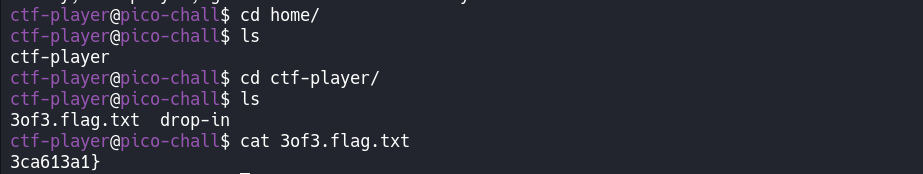

# Magikarp Ground Mission

## Overview

**Points:** 30\
**Tags:** General Skills

## Description

Do you know how to move between directories and read files in the shell? Start the container, `ssh` to it, and then `ls` once connected to begin. Login via `ssh` as `ctf-player` with the password, `ee388b88`.\
Additional details will be available after launching your challenge instance.

## Hints

1. Finding a cheatsheet for bash would be really helpful!

## Approach

Firstly, connect to the target machine via ssh following the challenge's instructions.\
Then see some information of the target:

Oke, let's see what's in `1of3.flag.txt`

A piece of the flag!  How about `instructions-to-2of3.txt`?

Oke, just follow the instruction

Do the same thing before

Again

Oke, now we've got all the pieces. And the flag is ....

## Flag

`picoCTF{xxsh_0ut_0f_\/\/4t3r_3ca613a1}`