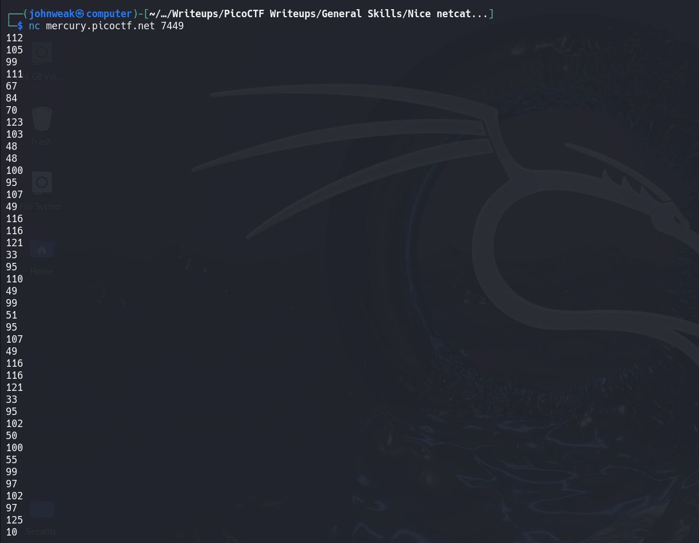
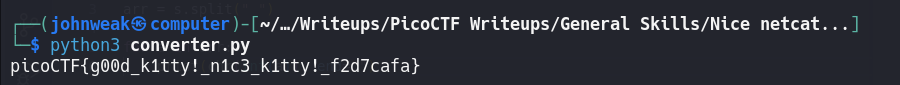
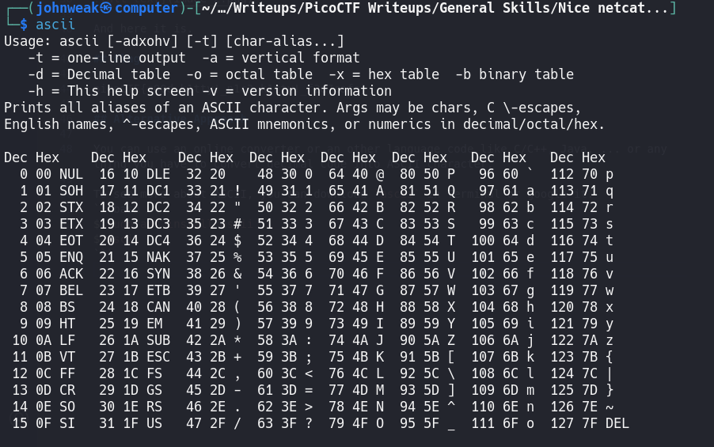

# Nice netcat...

## Overview

**Points:** 15\
**Tags:** General Skills

## Description

There is a nice program that you can talk to by using this command in a shell:\
`$ nc mercury.picoctf.net 7449`, but it doesn't speak English...

## Hints

1. You can practice using Netcat with this picoGym problem: [what's a netcat?](https://play.picoctf.org/practice/challenge/34)
2. You can practice reading and writing ASCII with this picoGym problem: [Let's warm up](https://play.picoctf.org/practice/challenge/22)

## Approach

Let's try to run the command in **Description**

I can make it easier to look by using a pipe with `tr` command and flag `-d`

wanna know more about `tr`, google it or you can use `man tr`.

Oke, back to the challenge, we have an array of numbers. It looks like ASCII codes in decimal. I can try to write a simple program called "converter.py" helping to convert decimal string into ASCII in python.
```python
s = "112 105 99 111 67 84 70 123 103 48 48 100 95 107 49 116 116 121 33 95 110 49 99 51 95 107 49 116 116 121 33 95 102 50 100 55 99 97 102 97 125 10"

arr = s.split(" ")

for a in arr:
    print(chr(int(a)), end="")

```

Oke, let's run this code:


And here it is.

## Flag

picoCTF{g00d_k1tty!_n1c3_k1tty!_f2d7cafa}

## Alternative Approach 

You can use an online converter or an other language code like C/C++, Java, ... or any thing you have to convert decimal code into ASCII character.

To see more about ASCII, you can download `ascii` in Terminal or google it.
```bash
$ sudo apt install ascii
$ ascii
```


## Extension

Wanna know about Netcat, search google or click the link below:\
https://linuxize.com/post/netcat-nc-command-with-examples/

Or you can use `man` command in your shell like:
```bash
$ man nc
```