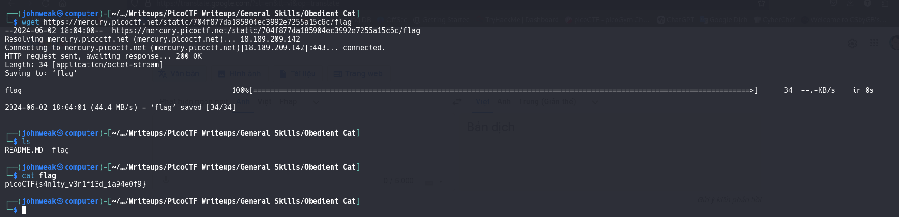
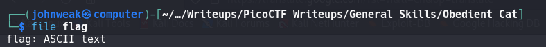

# Obedient Cat

## Overview

**Points:** 5\
**Tags:** General Skills

## Description

This file has a flag in plain sight (aka "in-the-clear"). [Download flag](./flag)

## Hints
1. Any hints about entering a command into the Terminal (such as the next one), will start with a `$ ... `everything after the dollar sign will be typed (or copy and pasted) into your Terminal.
2. To get the file accessible in your shell, enter the following in the Terminal prompt: `$ wget https://mercury.picoctf.net/static/704f877da185904ec3992e7255a15c6c/flag`
3. `$ man cat`

## Approach
Just download the file named "flag"
in the link and "cat" it



## Flag

`picoCTF{s4n1ty_v3r1f13d_1a94e0f9}`

And now we have what we need: the flag. You knew what thing we do next? Do it.

## Extension: 
We can see what type of file the 'flag' is by using `file` command
```bash
file flag
```

