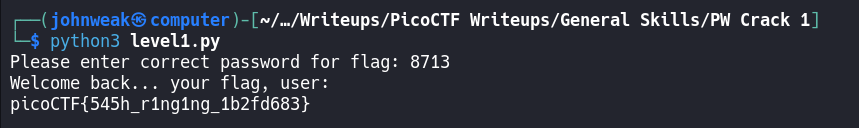

# PW Crack 1

## Overview

**Points:** 100\
**Tags:** General Skills, password_cracking

## Description

Can you crack the password to get the flag?\
Download the password checker [here](./level1.py) and you'll need the encrypted [flag](./level1.flag.txt.enc) in the same directory too.

## Hints

1. To view the file in the webshell, do: `$ nano level1.py`
2. To exit `nano`, press Ctrl + x and follow the on-screen prompts.
3. The `str_xor` function does not need to be reverse engineered for this challenge.

## Approach

Firstly, I wanna see the code in `level1.py`
```python
### THIS FUNCTION WILL NOT HELP YOU FIND THE FLAG --LT ########################
def str_xor(secret, key):
    #extend key to secret length
    new_key = key
    i = 0
    while len(new_key) < len(secret):
        new_key = new_key + key[i]
        i = (i + 1) % len(key)        
    return "".join([chr(ord(secret_c) ^ ord(new_key_c)) for (secret_c,new_key_c) in zip(secret,new_key)])
###############################################################################


flag_enc = open('level1.flag.txt.enc', 'rb').read()


def level_1_pw_check():
    user_pw = input("Please enter correct password for flag: ")
    if( user_pw == "8713"):
        print("Welcome back... your flag, user:")
        decryption = str_xor(flag_enc.decode(), user_pw)
        print(decryption)
        return
    print("That password is incorrect")


level_1_pw_check()

```
The script is a simple password checker.\
Basically, you need to run this script, and enter the password for flag.\
We can easily see that the password is `8713`. 



This is why we don't store passwords in plain text.

## Flag

`picoCTF{545h_r1ng1ng_1b2fd683}`