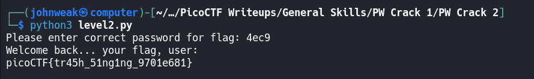

# PW Crack 2

## Overview

**Points:** 100\
**Tags:** General Skills, password_cracking

## Description

Can you crack the password to get the flag?\
Download the password checker [here](./level2.py) and you'll need the encrypted [flag](./level2.flag.txt.enc) in the same directory too.

## Hints

1. Does that encoding look familiar?
2. The `str_xor` function does not need to be reverse engineered for this challenge.

## Approach

Let's take a look at the python script:
```python
### THIS FUNCTION WILL NOT HELP YOU FIND THE FLAG --LT ########################
def str_xor(secret, key):
    #extend key to secret length
    new_key = key
    i = 0
    while len(new_key) < len(secret):
        new_key = new_key + key[i]
        i = (i + 1) % len(key)        
    return "".join([chr(ord(secret_c) ^ ord(new_key_c)) for (secret_c,new_key_c) in zip(secret,new_key)])
###############################################################################

flag_enc = open('level2.flag.txt.enc', 'rb').read()


def level_2_pw_check():
    user_pw = input("Please enter correct password for flag: ")
    if( user_pw == chr(0x34) + chr(0x65) + chr(0x63) + chr(0x39) ):
        print("Welcome back... your flag, user:")
        decryption = str_xor(flag_enc.decode(), user_pw)
        print(decryption)
        return
    print("That password is incorrect")


level_2_pw_check()

```

It's so familiar. Did you do the challenge `PW Crack 1`? This challenge is the similar thing but the password is in hex format: `chr(0x34) + chr(0x65) + chr(0x63) + chr(0x39)`

Try to figure it out:


Easy! Just back the the challenge, run the cript and enter the password we found.



## Flag

`picoCTF{tr45h_51ng1ng_9701e681}`