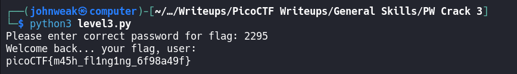

# PW Crack 3

## Overview

**Points:** 100\
**Tags:** General Skills, password_cracking, hashing

## Description

Can you crack the password to get the flag?\
Download the password checker [here](./level3.py) and you'll need the encrypted [flag](./level3.flag.txt.enc) and the [hash](./level3.hash.bin) in the same directory too.\
There are 7 potential passwords with 1 being correct.You can find these by examining the password checker script.

## Hints

1. To view the level3.hash.bin file in the webshell, do: `$ bvi leval3.hash.bin`
2. To exit `bvi` type `:q` and press enter.
3. The `str_xor` function does not need to be reverse engineered for this challenge.

## Approach

Firstly, take a look at the python script, it might have something useful for us:

```python
import hashlib

### THIS FUNCTION WILL NOT HELP YOU FIND THE FLAG --LT ########################
def str_xor(secret, key):
    #extend key to secret length
    new_key = key
    i = 0
    while len(new_key) < len(secret):
        new_key = new_key + key[i]
        i = (i + 1) % len(key)        
    return "".join([chr(ord(secret_c) ^ ord(new_key_c)) for (secret_c,new_key_c) in zip(secret,new_key)])
###############################################################################

flag_enc = open('level3.flag.txt.enc', 'rb').read()
correct_pw_hash = open('level3.hash.bin', 'rb').read()


def hash_pw(pw_str):
    pw_bytes = bytearray()
    pw_bytes.extend(pw_str.encode())
    m = hashlib.md5()
    m.update(pw_bytes)
    return m.digest()


def level_3_pw_check():
    user_pw = input("Please enter correct password for flag: ")
    user_pw_hash = hash_pw(user_pw)
    
    if( user_pw_hash == correct_pw_hash ):
        print("Welcome back... your flag, user:")
        decryption = str_xor(flag_enc.decode(), user_pw)
        print(decryption)
        return
    print("That password is incorrect")


level_3_pw_check()


# The strings below are 7 possibilities for the correct password. 
#   (Only 1 is correct)
pos_pw_list = ["8799", "d3ab", "1ea2", "acaf", "2295", "a9de", "6f3d"]


```

Oke, how does it work? The program asks you to provide a correct password. The password you entered is hashed and then compares with the hashed string in `level3.hash.bin`. But the correct password is one of passwords in `pos_pw_list`, so we can write a python script to try them one by one. We will use the `hashlib` library to hash the passwords and compare them to the hash file.

```python
import hashlib

correct_pw_hash = open("level3.hash.bin", "rb").read()

pos_pw_list = ["8799", "d3ab", "1ea2", "acaf", "2295", "a9de", "6f3d"]

def hash_pw(pw_str):
    pw_bytes = bytearray() # initialize an empty bytearray (it's a mutable sequence of bytes)
    pw_bytes.extend(pw_str.encode()) # encode pw_str into bytes using UTF-8 (default) encoding and extends pw_bytes with these bytes.
    m = hashlib.md5() # create a new MD5 hash object `m` using hashlib.md5() fuction
    m.update(pw_bytes) # update the MD5 hash object `m` with bytes form `pw_bytes`. This processes the data and computes the hash
    return m.digest() # return the binary (non-hexadecimal) degest of the hash. it returns the hash value as a bytes object.

for pw in pos_pw_list:
    if (hash_pw(pw) == correct_pw_hash):
        print(pw, end='')
        break

```

I name it `pwcracker.py`, run it now:


Oke, so my correct password is `2295`. Back to the challenge, run the script and type the password in:




Reading the file `level3.hash.bin` is not helpful for us, so i skip it over
## Flag

`picoCTF{m45h_fl1ng1ng_6f98a49f}`
