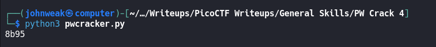
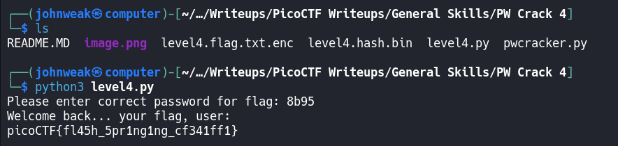

# PW Crack 4

## Overview

**Points:** 100\
**Tags:** General Skills, password_cracking, hasing

## Description

Can you crack the password to get the flag?\
Download the password checker [here](./level4.py) and you'll need the encrypted [flag](./level4.flag.txt.enc) and the [hash](./level4.hash.bin) in the same directory too.\
There are 100 potential passwords with only 1 being correct. You can find these by examining the password checker script.

## Hints

1. A for loop can help you do many things very quickly.
2. The str_xor function does not need to be reverse engineered for this challenge.

## Approach

Get files from the links in the same directory. Take a look at file `level4.py`

```python
import hashlib

### THIS FUNCTION WILL NOT HELP YOU FIND THE FLAG --LT ########################
def str_xor(secret, key):
    #extend key to secret length
    new_key = key
    i = 0
    while len(new_key) < len(secret):
        new_key = new_key + key[i]
        i = (i + 1) % len(key)        
    return "".join([chr(ord(secret_c) ^ ord(new_key_c)) for (secret_c,new_key_c) in zip(secret,new_key)])
###############################################################################

flag_enc = open('level4.flag.txt.enc', 'rb').read()
correct_pw_hash = open('level4.hash.bin', 'rb').read()


def hash_pw(pw_str):
    pw_bytes = bytearray()
    pw_bytes.extend(pw_str.encode())
    m = hashlib.md5()
    m.update(pw_bytes)
    return m.digest()


def level_4_pw_check():
    user_pw = input("Please enter correct password for flag: ")
    user_pw_hash = hash_pw(user_pw)
    
    if( user_pw_hash == correct_pw_hash ):
        print("Welcome back... your flag, user:")
        decryption = str_xor(flag_enc.decode(), user_pw)
        print(decryption)
        return
    print("That password is incorrect")


level_4_pw_check()


# The strings below are 100 possibilities for the correct password. 
#   (Only 1 is correct)
pos_pw_list = ["158f", "1655", "d21e", "4966", "ed69", "1010", "dded", "844c", "40ab", "a948", "156c", "ab7f", "4a5f", "e38c", "ba12", "f7fd", "d780", "4f4d", "5ba1", "96c5", "55b9", "8a67", "d32b", "aa7a", "514b", "e4e1", "1230", "cd19", "d6dd", "b01f", "fd2f", "7587", "86c2", "d7b8", "55a2", "b77c", "7ffe", "4420", "e0ee", "d8fb", "d748", "b0fe", "2a37", "a638", "52db", "51b7", "5526", "40ed", "5356", "6ad4", "2ddd", "177d", "84ae", "cf88", "97a3", "17ad", "7124", "eff2", "e373", "c974", "7689", "b8b2", "e899", "d042", "47d9", "cca9", "ab2a", "de77", "4654", "9ecb", "ab6e", "bb8e", "b76b", "d661", "63f8", "7095", "567e", "b837", "2b80", "ad4f", "c514", "ffa4", "fc37", "7254", "b48b", "d38b", "a02b", "ec6c", "eacc", "8b70", "b03e", "1b36", "81ff", "77e4", "dbe6", "59d9", "fd6a", "5653", "8b95", "d0e5"]


```

Is this challenge familiar? It's exactly like challenge `PW Crack 3`, but with 100 possibilities passwords.

So, i will give my [pwcracker.py](./pwcracker.py) bellow, it just uses a for loop to iterates through 100 given possible passwords to take the only correct password.

```python

import hashlib

pos_pw_list = ["158f", "1655", "d21e", "4966", "ed69", "1010", "dded", "844c", "40ab", "a948", "156c", "ab7f", "4a5f", "e38c", "ba12", "f7fd", "d780", "4f4d", "5ba1", "96c5", "55b9", "8a67", "d32b", "aa7a", "514b", "e4e1", "1230", "cd19", "d6dd", "b01f", "fd2f", "7587", "86c2", "d7b8", "55a2", "b77c", "7ffe", "4420", "e0ee", "d8fb", "d748", "b0fe", "2a37", "a638", "52db", "51b7", "5526", "40ed", "5356", "6ad4", "2ddd", "177d", "84ae", "cf88", "97a3", "17ad", "7124", "eff2", "e373", "c974", "7689", "b8b2", "e899", "d042", "47d9", "cca9", "ab2a", "de77", "4654", "9ecb", "ab6e", "bb8e", "b76b", "d661", "63f8", "7095", "567e", "b837", "2b80", "ad4f", "c514", "ffa4", "fc37", "7254", "b48b", "d38b", "a02b", "ec6c", "eacc", "8b70", "b03e", "1b36", "81ff", "77e4", "dbe6", "59d9", "fd6a", "5653", "8b95", "d0e5"]

correct_pw_hash = open('level4.hash.bin', 'rb').read()

def hash_pw(pw_str):
    m = hashlib.md5()
    m.update(pw_str.encode())
    return m.digest()
def solve():
    for pw in pos_pw_list:
        if (hash_pw(pw) == correct_pw_hash):
            print(pw)
            return

solve()

```

Oke, let's run it now

Here you are. The correct password is `8b95`\
Go ahead, run `level4.py` to get the flag!


## Flag

`picoCTF{fl45h_5pr1ng1ng_cf341ff1}`
