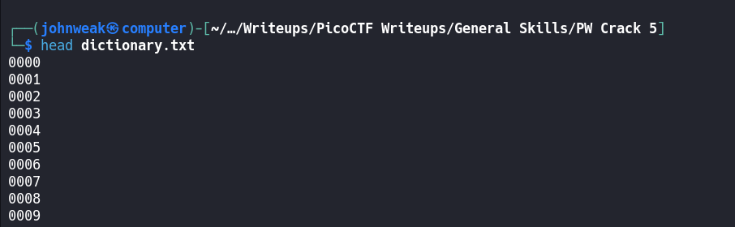
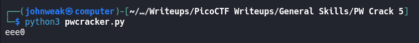
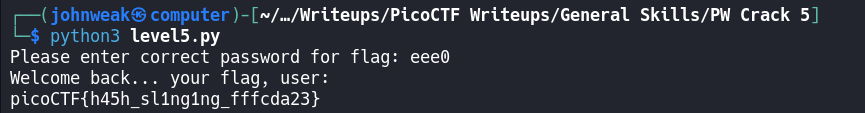

# PW Crack 5

## Overview

**Points:** 100\
**Tags:** General Skills, password_cracking, hashing

## Description

Can you crack the password to get the flag?\
Download the password checker [here](./level5.py) and you'll need the encrypted [flag](./level5.flag.txt.enc) and the [hash](./level5.hash.bin) in the same directory too. Here's a [dictionary](./dictionary.txt) with all possible passwords based on the password conventions we've seen so far.

## Hints

1. Opening a file in Python is crucial to using the provided dictionary.
2. You may need to trim the whitespace from the dictionary word before hasing. Look up the Python string function, `strip`
3. The `str_xor` function does not need to be reverse engineered for this challenge.

## Approach

Oke, This challenge is similar to previous `PW Crack` challenges. But for now, we need to get the possible password array from a text file named `dictionary.txt`.

We can see all possible password in `dictionary.txt`, i'll show first 10 passwords in there:

Stupid! Oke, so how can i get them from this file in Python and pass them into an array?

I think we can do it in 2 common ways

```python
pos_pw_list = open('dictionary.txt', 'r').read().splitlines()
```

```python
pos_pw_list = open('dictionary.txt', 'r').readlines()

pos_pw_list = [pw.strip() for pw in pos_pw_list]

```

In way 1, we read the content of `dictionary.txt` into a string and split it in the newline characters (`splitlines()`)

In way 2, we read the content in each line and pass it into an array, and then we use `list comprehension` as a short hand to iterate through each element in the array and map to new value by an expression `pw.strip()`. the `strip()` function is used to remove all whitespaces in each `pw`. You can specify which character(s) to remove, if not, any whitespaces will be removed.

Oke, in this case, i will use way 1, but you can choose any way you like.\
Here is [my python script](./pwcracker.py):

```python

import hashlib

pos_pw_list = open('dictionary.txt', 'r').read().splitlines()
correct_pw_hash = open('level5.hash.bin', 'rb').read()

def hash_pw(pw_str):
    m = hashlib.md5()
    m.update(pw_str.encode())
    return m.digest()

def solve():
    for pw in pos_pw_list:
        if (hash_pw(pw) == correct_pw_hash):
            print(pw)
            return

solve()

```

Oke, let's run this script to get the correct password:



Alright, the password for the flag is `eee0`. Run `level5.py`, enter the password and complete the rest!



## Flag

`picoCTF{h45h_sl1ng1ng_fffcda23}`