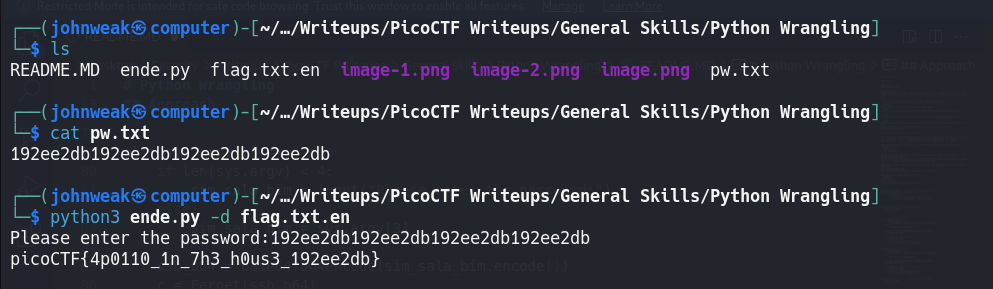

# Python Wrangling

## Overview

**Points:** 10\
**Tags:** General Skills
 
## Description
Python scripts are invoked kind of like programs in the Terminal... Can you run [this Python script](./ende.py) using [this password](./pw.txt) to get [the flag](./flag.txt.en)?
## Hints
1. Get the Python script accessible in your shell by using `wget`
2. `$ man python` --> it's the old version, now we use `python3`
## Approach
First, get all the file in the links by using `wget`.
```bash
wget https://mercury.picoctf.net/static/5c4c0cbfbc149f3b0fc55c26f36ee707/ende.py
```
```bash
wget https://mercury.picoctf.net/static/5c4c0cbfbc149f3b0fc55c26f36ee707/pw.txt
```
```bash
wget https://mercury.picoctf.net/static/5c4c0cbfbc149f3b0fc55c26f36ee707/flag.txt.en
```
Now we have 3 files in the current directory, we can use `ls` to see


**`ls` is to list directory contents**

> In this case, i used the option/flag `-l` to list the current directory contents into the ***long list format***. There are many options/flags of the `ls` command, to see more we can use `man ls` in your Terminal, this is a manual for `ls` command.

Oke, now we should try see what is in these files. To do it, you can use the `cat` command like:
```bash
$ cat [filename]
```
Or you can choose many other different text editors like nano, vim, vscode, ..., You should google them later.\
For now, I'll use sublime text, it's the favourite text editor of my favourite youtuber (just fun). Google to know how to install sublime text.

But before to open these file by **sublime text**, we should see what kinds of files they are.

You know what? I think file 'flag.txt.en' is encrypted.

Oke, now we open file 'ende.py' first.
```python
import sys
import base64
from cryptography.fernet import Fernet


usage_msg = "Usage: "+ sys.argv[0] +" (-e/-d) [file]"
help_msg = usage_msg + "\n" +\
        "Examples:\n" +\
        "  To decrypt a file named 'pole.txt', do: " +\
        "'$ python "+ sys.argv[0] +" -d pole.txt'\n"


if len(sys.argv) < 2 or len(sys.argv) > 4:
    print(usage_msg)
    sys.exit(1)


if sys.argv[1] == "-e":
    if len(sys.argv) < 4:
        sim_sala_bim = input("Please enter the password:")
    else:
        sim_sala_bim = sys.argv[3]

    ssb_b64 = base64.b64encode(sim_sala_bim.encode())
    c = Fernet(ssb_b64)

    with open(sys.argv[2], "rb") as f:
        data = f.read()
        data_c = c.encrypt(data)
        sys.stdout.write(data_c.decode())


elif sys.argv[1] == "-d":
    if len(sys.argv) < 4:
        sim_sala_bim = input("Please enter the password:")
    else:
        sim_sala_bim = sys.argv[3]

    ssb_b64 = base64.b64encode(sim_sala_bim.encode())
    c = Fernet(ssb_b64)

    with open(sys.argv[2], "r") as f:
        data = f.read()
        data_c = c.decrypt(data.encode())
        sys.stdout.buffer.write(data_c)


elif sys.argv[1] == "-h" or sys.argv[1] == "--help":
    print(help_msg)
    sys.exit(1)


else:
    print("Unrecognized first argument: "+ sys.argv[1])
    print("Please use '-e', '-d', or '-h'.")

```
It's a Python code.
> **You need to learn Python to understand what this Python code does.**

To run this Python program, we use:
```bash
$ python3 ende.py
```

Oke, now follow the instructions, we will have the flag. Bellow is my solution:


## Flag

picoCTF{4p0110_1n_7h3_h0us3_192ee2db}

