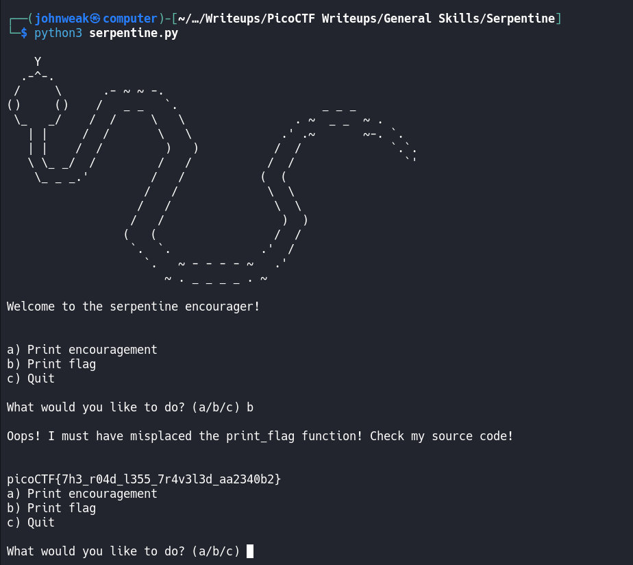

# Serpentine

## Overview

**Points:** 100\
**Tags:** General Skills, Python

## Description

Find the flag in the Python script!\
[Download Python script](./serpentine.py)

## Hints

1. Try running the script and see what happens
2. In the webshell, try examining the script with a text editor like `nano`
3. To exit nano, press Ctrl and x and follow the on-screen prompts.
4. The str_xor function does not need to be reverse engineered for this challenge.

## Approach

As i said before, there are many text editor you can use such as subl, vscode, vim, nano, ...\
In this challenge, i will use `nano`. let's see what's in file `serpentine.py` by:

```bash
$ nano serpentine.py
```

And below is its content:

```python

import random
import sys


def str_xor(secret, key):
    #extend key to secret length
    new_key = key
    i = 0
    while len(new_key) < len(secret):
        new_key = new_key + key[i]
        i = (i + 1) % len(key)        
    return "".join([chr(ord(secret_c) ^ ord(new_key_c)) for (secret_c,new_key_c) in zip(secret,new_key)])


flag_enc = chr(0x15) + chr(0x07) + chr(0x08) + chr(0x06) + chr(0x27) + chr(0x21) + chr(0x23) + chr(0x15) + chr(0x5c) + chr(0x01) + chr(0x57) + chr(0x2a) + chr(0x17) + chr(0x5e) + chr(0x5f) + chr(0x0d) + chr(0x3b) + chr(0x19) + chr(0x56) + chr(0x5b) + chr(0x5e) + chr(0x36) + chr(0x53) + chr(0x07) + chr(0x51) + chr(0x18) + chr(0x58) + chr(0x05) + chr(0x57) + chr(0x11) + chr(0x3a) + chr(0x0f) + chr(0x0a) + chr(0x5b) + chr(0x57) + chr(0x41) + chr(0x55) + chr(0x0c) + chr(0x59) + chr(0x14)


def print_flag():
  flag = str_xor(flag_enc, 'enkidu')
  print(flag)


def print_encouragement():
  encouragements = ['You can do it!', 'Keep it up!', 
                    'Look how far you\'ve come!']
  choice = random.choice(range(0, len(encouragements)))
  print('\n-----------------------------------------------------')
  print(encouragements[choice])
  print('-----------------------------------------------------\n\n')


def main():

  print(
'''
    Y
  .-^-.
 /     \      .- ~ ~ -.
()     ()    /   _ _   `.                     _ _ _
 \_   _/    /  /     \   \                . ~  _ _  ~ .
   | |     /  /       \   \             .' .~       ~-. `.
   | |    /  /         )   )           /  /             `.`.
   \ \_ _/  /         /   /           /  /                `'
    \_ _ _.'         /   /           (  (
                    /   /             \  \\
                   /   /               \  \\
                  /   /                 )  )
                 (   (                 /  /
                  `.  `.             .'  /
                    `.   ~ - - - - ~   .'
                       ~ . _ _ _ _ . ~
'''
  )
  print('Welcome to the serpentine encourager!\n\n')
  
  while True:
    print('a) Print encouragement')
    print('b) Print flag')
    print('c) Quit\n')
    choice = input('What would you like to do? (a/b/c) ')
    
    if choice == 'a':
      print_encouragement()
      
    elif choice == 'b':
      print('\nOops! I must have misplaced the print_flag function! Check my source code!\n\n')
      
    elif choice == 'c':
      sys.exit(0)
      
    else:
      print('\nI did not understand "' + choice + '", input only "a", "b" or "c"\n\n')


if __name__ == "__main__":
  main()


```

You can figure out that if we choose option `b`, it will print the flag out by function `print_flag`. But it's forgotten.\
So we simply put this function in right place. The code in the snippet to process option b looks like:
```python
    elif choice == 'b':
      print('\nOops! I must have misplaced the print_flag function! Check my source code!\n\n')
      print_flag()
```
Oke, to save the change in `nano` editor, we press Ctrl + x and follow the on-screen prompts. And after we run it, we have the flag.


## Flag

`picoCTF{7h3_r04d_l355_7r4v3l3d_aa2340b2}`
