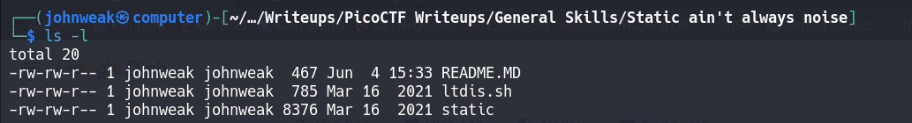
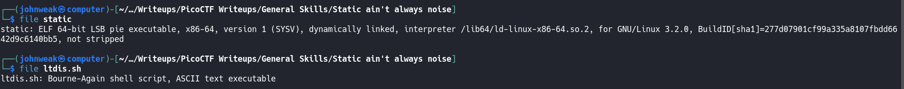
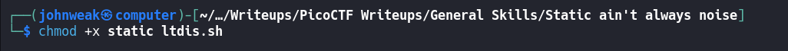
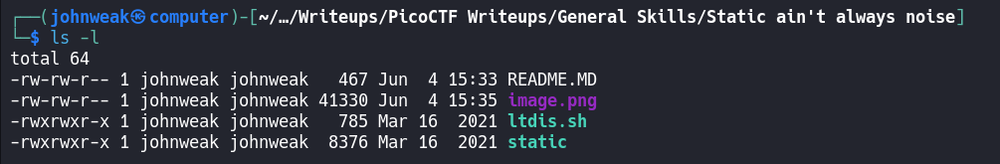
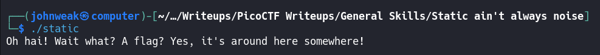
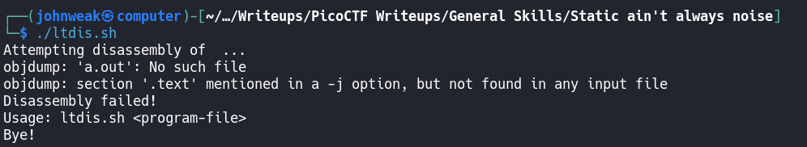
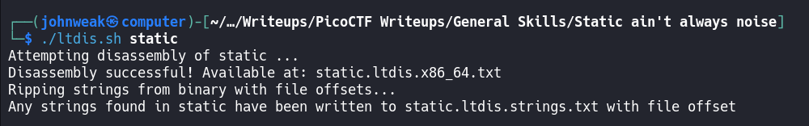
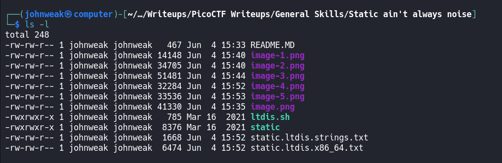
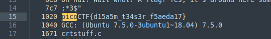
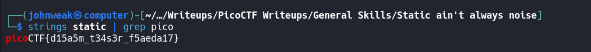

# Static ain't always noise

## Overview

**Points:** 20\
**Tags:** General Skills

## Description

Can you look at the data in this binary: [static](./static)? This [BASH script](./ltdis.sh) might help!

## Hints

(none)

## Approach

Firstly, get these two files from the links
```bash
$ wget https://mercury.picoctf.net/static/66932732825076cad4ba43e463dae82f/static

$ wget https://mercury.picoctf.net/static/66932732825076cad4ba43e463dae82f/ltdis.sh
```
Let's take a look at our current directory:

Oke, I've already had 2 file. I'm curious that what file type they are, I can use `file` command. 


Alright, they are both executable files. But both of them don't have execute permission. Just give them it.

Check it


Fine! Now we're gonna see the content of `ltdis.sh`. I will use sublime text
```bash
$ subl ltdis.sh
```

```shell
#!/bin/bash


echo "Attempting disassembly of $1 ..."


#This usage of "objdump" disassembles all (-D) of the first file given by 
#invoker, but only prints out the ".text" section (-j .text) (only section
#that matters in almost any compiled program...

objdump -Dj .text $1 > $1.ltdis.x86_64.txt


#Check that $1.ltdis.x86_64.txt is non-empty
#Continue if it is, otherwise print error and eject

if [ -s "$1.ltdis.x86_64.txt" ]
then
	echo "Disassembly successful! Available at: $1.ltdis.x86_64.txt"

	echo "Ripping strings from binary with file offsets..."
	strings -a -t x $1 > $1.ltdis.strings.txt
	echo "Any strings found in $1 have been written to $1.ltdis.strings.txt with file offset"


else
	echo "Disassembly failed!"
	echo "Usage: ltdis.sh <program-file>"
	echo "Bye!"
fi

```
Honestly, i, in the present, don't understand this shell code. So just go ahead and run these files.



Follow the instructions:


Oh, any strings found in `static` have been written to `static.ltdis.strings.txt`:

Don't bother with stuff on upper `ltdis.sh`, I just use these things to write this writeup.
so, we have two new text file.
Open `static.ltdis.strings.txt` first, I use `subl`. 


Oke, I have many things here, try searching `picoCTF` (shorthand: Ctrl + F)

here it is!
## Flag

picoCTF{d15a5m_t34s3r_f5aeda17}

## Alternative Approach

As soon as we have 2 files, try using `strings` command to see readable content in the file named `static` with filter "*pico*"


Easy!