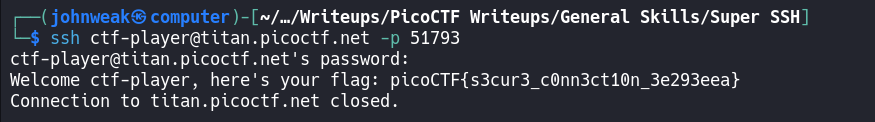
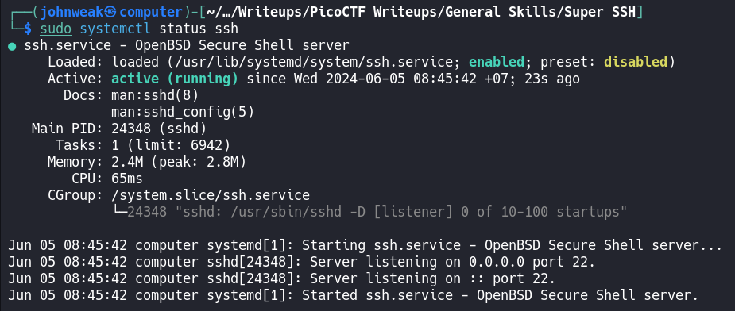

# Super SSH

## Overview 

**Points:** 25\
**Tags:** General Skills, shell, ssh

## Description

Using a Secure Shell (SSH) is going to be pretty important.\
Additional details will be available after launching your challenge instance.

## Hints

1. https://linux.die.net/man/1/ssh
2. You can try logging in 'as' someone with <user>@titan.picoctf.net
3. How could you specify the port
4. Remember, passwords are hidden when typed into the shell

## Approach

Launch our challenge instance first. And then use the following command to connect to the target machine via SSH to get the flag
```bash
$ ssh ctf-player@titan.picoctf.net -p 51793
```
Accept the fingerprint with `yes` and you'll alse need the password from your challange.

After that, you have:


## Flag

picoCTF{s3cur3_c0nn3ct10n_3e293eea}

## What is SSH?
SSh stands for "Secure Shell". It is a network protocol used for secure access to a remote computer. SSH provides a secure channel over an unsecured network by using encryption to protect the data transferred between the client and the server. It is commonly used for remote command-line login, remote command execution, and secure file transfer.

Key features of SSH include: 
- **Encryption:** Ensures that all data sent between the SSH client and server is encrypted
- **Authentication:** Supports various methods of authenticating users, such as passwords, public key authentication, ...
- **Integrity:** Ensures data integrity by using cryptographic hash functions to verify data has not been altered during transmission.

SSH runs on port **`22`** by default
## How can we set up an SSH connection?

### On the Server Side

1. Install OpenSSH Server (on Linux system)

```bash
$ sudo apt update && sudo apt upgrade -y && sudo apt install openssh-server
```
2. Start and Enable SSH Service

```bash
sudo systemctl start ssh
sudo systemctl enable ssh
```

Check if it runs properly

```bash
$ sudo systemctl status ssh
```


It seems ok. Now we need to ensure the firewall allows SSH connections (on port 22)\
(install `ufw` tool before)
```bash
$ sudo ufw allow ssh
$ sudo ufw enable
```

### On the Client Side

1. Install SSH Client

- On most Linux systems and macOS, an SSH client is installed by default. For Windows, you can use the built-in OpenSSH client or third-party tool like PuTTY

2. Connect to Server

```bash
$ ssh [username]@[hostname_or_ip]
```

By default, it will connect to port 22. If not, use `-p [port number]` to connect to specific port that server offers

3. Accept the Server's Key

- The first time you connect to the server, you will be asked to accept its SSH key. Type `yes` and press Enter

4. Enter Your Password

- Enter the password for the user account your are using to connect.

### Wanna stop providing ssh server service?

```bash
$ sudo systemctl disable ssh
$ sudo systemctl stop ssh
```

Check again
```bash
$ sudo systemctl status ssh
```

> If you wanna know how to log in with public key or log in without password, `google` it
