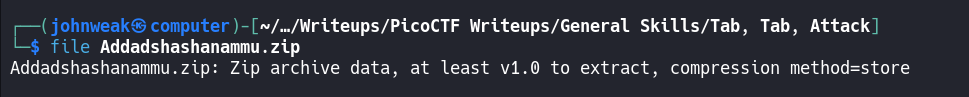
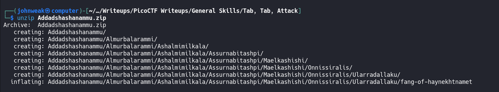
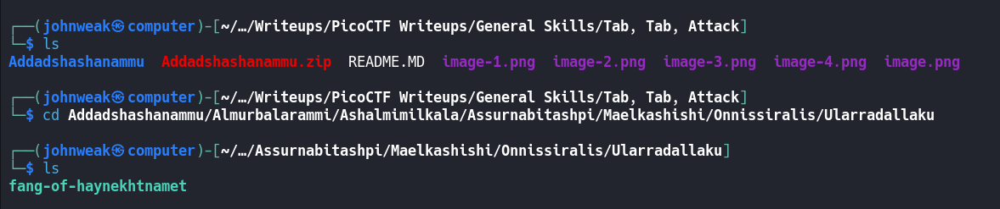
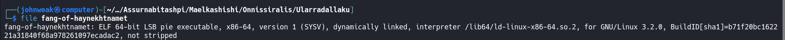
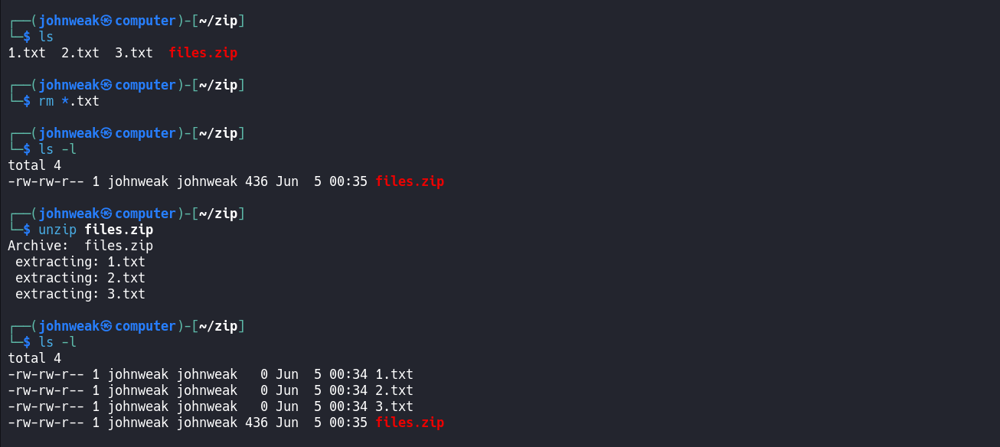
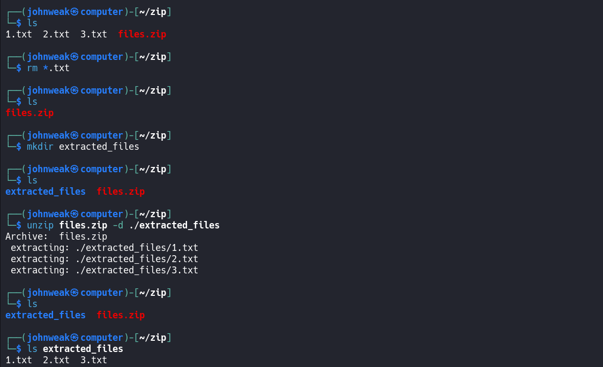
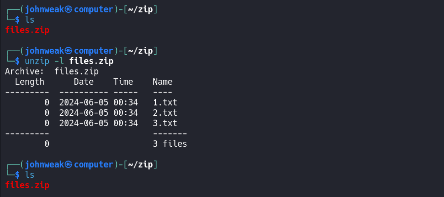

# Tab, Tab, Attack

## Overview

**Points:** 20\
**Tags:** General Skills

## Description

Using tabcomplete in the Terminal will add years to your life, esp. When dealing with long rambling directory structures and filenames: [Addadshashanammu.zip](./Addadshashanammu.zip)

## Hints

1. After `unzip`ing, this problem can be solved with 11 button-presses...(mostly Tab)...

## Approach 

Copy the link and using `wget` to download the file name `Addadshashanammu.zip` from it:

```bash
wget https://mercury.picoctf.net/static/72712e82413e78cc8aa8d553ffea42b0/Addadshashanammu.zip
```
Oke, now we see what file type it is


A zip file, it's called a ZIP archive. So what can we do now? Let's go ahead and unzip it. 

And we have a directory inside another directory inside another directory inside another directory ... These things make me crazy @@.
Just `cd` them until you can't
 

Oh, I found a file, it's not a directory. Let's see what type of file it is:

It's an ELF excutable. 

Wanna see the readable strings inside it? Here you are


Done!

But i'm still curious about this file, I wanna run it:


LOL!

## Flag

`picoCTF{l3v3l_up!_t4k3_4_r35t!_6f332f10}`

## Extention

To zip files, we can use `zip` command. There is an example bellow:


Wanna unzip it in current directory, let's try it:


Wanna unzip a ZIP archive into a specific directory, using `-d` flag:


Or we can show the list of file in ZIP archive before unzip it by using `-l` option:


That's all you need to know. Wanna know more, see the manpage (`man`) of them or google.