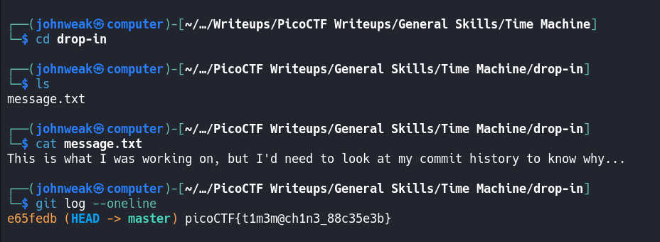

# Time Mchine

## Overview

**Points:** 50\
**Tags:** General Skills, browser_webshell_solvable, git

## Description

What was I last working on? I remember writing a note to help me remember...\
You can download the challenge files here:
- [challenge.zip](./challenge.zip)

## Hints

1. The `cat` command will let you read a file, but that won't help you here!
2. Read the chapter on Git from the picoPrimer [here](https://primer.picoctf.org/#_git_version_control)
3. When committing a file with git, a message can (and should) be included.

## Approach

First of all, using `wget` to get the file. And then see what are inside it before unzip. Remember that? let's check:
```bash
$ wget [link]
$ unzip -l challenge.zip
```
There are many things inside a directory named `drop-in`. Now unzip it:
```bash
$ unzip challenge.zip
```
Oke, we got `drop-in`, exploring time:



Ukm, this challenge teaches you about `git log` command. Have you used it before?

## Flag

`picoCTF{t1m3m@ch1n3_88c35e3b}`
