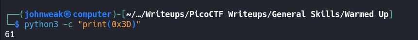

# Warmed UP

## Overview

**Points:** 50\
**Tags:** General Skills

## Description

What is 0x3D (base 16) in decimal (base 10)?

## Hints

1. Submit your answer in our flag format. For example, if your answer was '22', you would submit 'picoCTF{22}' as the flag

## Approach

Hexadecimal (hex) is a base-16 number system use 16 distinct symbols: 0-9 represent values 0 to 9, and A-F (or a-f) represent values 10 to 15. It's used in mathematics and computing. There're so many uses of hex, some sommon uses are: memory addresses, color codes, data representatoin or programming, ...

Hex form typically prefixed with `0x` like `0xFF`

So **how we can convert hex to dec?** You multiply each digit by 16 raised to the power of its position (starting from 0 on the right).

0x3D in hex --> 3 * 161 + 13 * 160 = 61 in dec

## Flag

`picoCTF{61}`

## Alternative Approach

You can use Python to quickly convert from a format to another.

Let's try:

