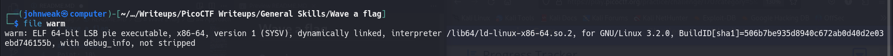
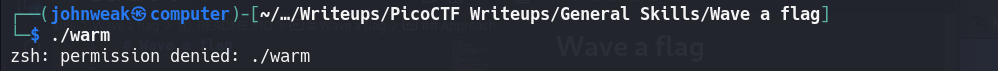
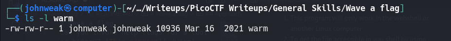
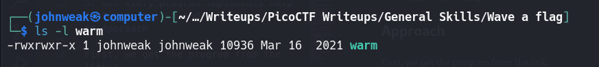
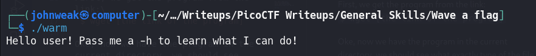
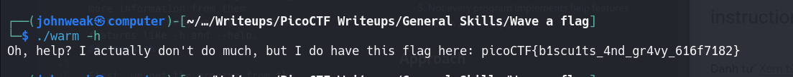
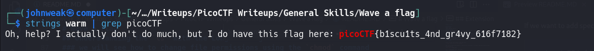

# Wave a flag

## Overview
Points: 10\
Tags: General Skills
## Description
Can you invoke help flags for a tool or binary? [This program](./warm) has extraordinarily helpful information...
## Hints
1. This program will only work in the webshell or another Linux computer
2. To get the file accessible in you shell by using `wget`
3. Run this program by entering the following in the Terminal prompt: `$ ./warm`, but you'll first have to make it executable with `$ chmod +x warm`
4. -h and --help are the most common arguments to give to programs to get more information from them.
5. Not every program implements help features like -h and --help.
## Approach

First, we get the program from the link:\
`$ wget [the link of the program]`

Oke, now we have the program in the current directory, we should see what exactly type of the file is. 


It's a executable file, blah blah. \
Let's try to run it.

oke, permission denied, check it:


yeah, it does not have execute permission on any object (group, owner, others)
Try to add it by using `chmod` command.
```bash
$ chmod +x warm
```
oke, let's check again

Now we have the execute permission on this file. Run it:

Follow the instruction:


Done!!
## Flag

picoCTF{b1scu1ts_4nd_gr4vy_616f7182}

## Understanding the `ls` with the Long Listing Format

```bash
$ ls -l
```
Example output:

```
total 16
drwxr-xr-x 2 user group 4096 May 25 10:45 dir1
-rw-r--r-- 1 user group  123 May 25 10:45 file1
```
### In this output:
- `drwxr-xr-x` shows the file type and the permissions
- `2` indicates the number of links
- `user` is the owner of the file
- `group` is the group associated with the file
- `4096` is the file size in bytes
- `May 25 10:45` is the last modification date and time
- `dir1` and `file1` are the names of the directory and the file, respectively

### Understand the permission bits:
`drwxr-xr-x`\
So, the first character is the file type:
- `-` for a regular file
- `d` for a directory
- `l` for a symbolic link

The next nine characters are grouped into three sets of there, representing the permissions for the owner, group and others:
- `r` stands for **read permission**
- `w` stands for **write permission**
- `x` stans for **execute permission**

And the computer understand it as the binary set like:\
`rwx | r-x| r-x`--> `111 101 101`

As you can see, `1 = enabled permission` and `0 = disable permission`

We can write the permissions in decimal like:

`600` = `110 000 000` = `rw-------` or `777` = `rwxrwxrwx`

### we will see how to change file permissions using the `chmod` command

We can use `+[permission]` to add a permission to all objects

Example:
```bash
$ chmod +x [filename]
```

If we want to add specific permissions for specific objects, we use decimal format:
Example:
```bash
$ chmod 754 [filename]
```

It means the permissions of the file now is `rwxr-xr--`, which means:
- The owner has read, write and execute permissions
- The group has read and execute permissions
- Others only have read permission.

**Wanna see more options of `ls` command, check `ls --help` or `man ls`**

*I took reference from [this web](https://linuxconfig.org/understanding-of-ls-command-with-a-long-listing-format-output-with-permission-bits)*

## Alternative Approach 

Back to the challenge CTF, as soon as we have the executable/binary file , we can try to extract all the readable strings from it by using `strings` command.

```bash
$ strings warm
```

And we can try to serch for the flag from its output by using a pipe.
```bash
$ strings warm | grep picoCTF
```


And opps, is that the flag? This is a trick!!

To learn more about grep or pipe on Linux, please googling.
