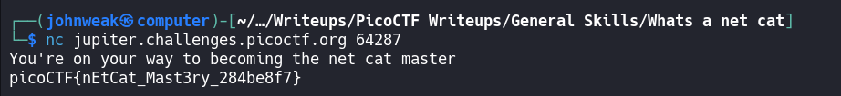

# What's a net cat?

## Overview

**Points:** 100\
**Tags:** General Skill

## Description

Using netcat (nc) is going to be pretty important. Can you connect to `jupiter.challenges.picoctf.org` at port `64287` to get the flag?

## Hints

nc [tutorial](https://linux.die.net/man/1/nc)

## Approach

I have no comment to talk about this challenge. It's just a tutorial for `nc`.

## Flag

`picoCTF{nEtCat_Mast3ry_284be8f7}`