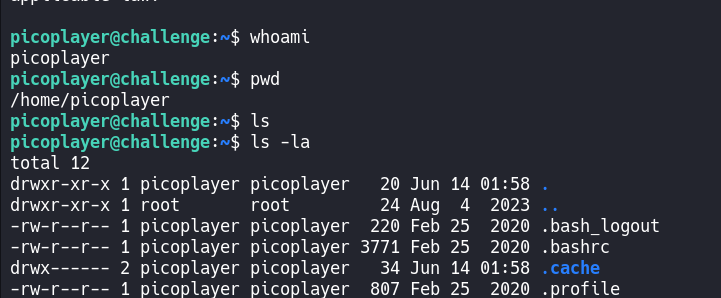
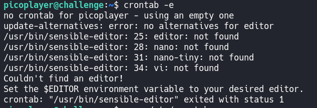
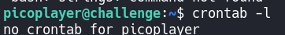
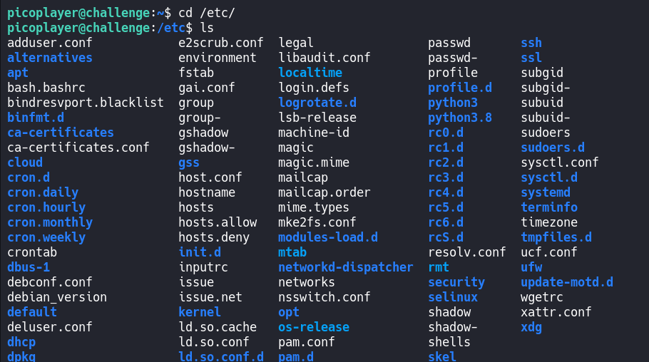
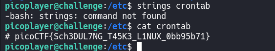

# chrono

## Overview

**Points:** 100\
**Tags:** General Skills, linux

## Description

How to automate tasks to run at intervals on linux servers?\
Additional details will be available after launching your challenge instance.

## Hints

(none)

## Approach

Launch instance first and use `ssh` to connect to this server. do you remember how to use it?

```bash
$ ssh picoplayer@saturn.picoctf.net -p 60273
```

Just following the on-screen instructions, and you will in the remote machine.
See some information i found:


It doesn't seem usefull.

The description says : "How to automate tasks to run at intervals on linux servers?"

ukm, it's a suggestion. Let's google it.

Bellow is something i found in geeksforgeeks:

> What is `Cron`? Cron is a job scheduling utility present in Unix like systems. \
> What is `Crontab`? It's the command-line utility that allows users to create, edit, and manage their own cron schedules. \
> A schedule looks like:  1 * * * * echo hello\
> Let me break it out: \
> `1 * * * *` are minute(0 - 59), hour(0 - 23), day in month(1 - 31), month in year(1-12), day in week(0 - 6)\
> `echo hello` is command or script to execute.

> the asterisk (*) means everything in the range.

> And some command with `crontab`:\
> - crontab - l to check the list of cron jobs
> - crontab -e to edit file `crontab` to add more schedules or remove something
> - crontab -r to remove all cron jobs available.

The crontab is a utility, so maybe it's in `/etc/` which contains the configuration files of the OS and apps.

Oke, back to our challenge, i will try opening crontab to edit some schedules:


There is no editor in remote machine, lol.

Oke, i will see if some cron jobs inside there:


there is nothing

Let's diggin deeper in /etc/


there are many things here. Can you see the file named `crontab`? 

here!

## Flag

`picoCTF{Sch3DUL7NG_T45K3_L1NUX_0bb95b71}`