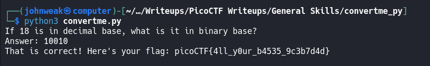

# convertme.py

## Overview

**Points:** 100\
**Tags:** General Skill, base, Python

## Description

Run the Python script and convert the given number from decimal to binary to get the flag.\
[Download Python script](./convertme.py)

## Hints

1. Look up a decimal to binary number conversion app on the web or use your computer's calculator
2. The str_xor function does not need to be reverse engineered for this challenge
3. If you have Python on your computer, you can download the script normally and run it. Otherwise, use the `wget` command in the webshell
4. To use `wget` in the webshell, first right click on the download link and select 'Copy Link' or `Copy Link Address`
5. Type everything after the dollar sign in the webshell: `$ wget`, the paste the link after the space after `wget` and press enter. This will download the script for you in the webshell so you can run it!
6. Finally, to run the script, type everything after the dollar sign and then press enter: `$ python3 convertme.py`

## Approach

This challenge is a test your converting ability from decimal to binary format.\
You just need to get the python script, run it and answer the question:



So let's take a look at file `convertme.py`:
```python

import random


def str_xor(secret, key):
    #extend key to secret length
    new_key = key
    i = 0
    while len(new_key) < len(secret):
        new_key = new_key + key[i]
        i = (i + 1) % len(key)        
    return "".join([chr(ord(secret_c) ^ ord(new_key_c)) for (secret_c,new_key_c) in zip(secret,new_key)])


flag_enc = chr(0x15) + chr(0x07) + chr(0x08) + chr(0x06) + chr(0x27) + chr(0x21) + chr(0x23) + chr(0x15) + chr(0x5f) + chr(0x05) + chr(0x08) + chr(0x2a) + chr(0x1c) + chr(0x5e) + chr(0x1e) + chr(0x1b) + chr(0x3b) + chr(0x17) + chr(0x51) + chr(0x5b) + chr(0x58) + chr(0x5c) + chr(0x3b) + chr(0x4c) + chr(0x06) + chr(0x5d) + chr(0x09) + chr(0x5e) + chr(0x00) + chr(0x41) + chr(0x01) + chr(0x13)


num = random.choice(range(10,101))

print('If ' + str(num) + ' is in decimal base, what is it in binary base?')

ans = input('Answer: ')

try:
  ans_num = int(ans, base=2)
  
  if ans_num == num:
    flag = str_xor(flag_enc, 'enkidu')
    print('That is correct! Here\'s your flag: ' + flag)
  else:
    print(str(ans_num) + ' and ' + str(num) + ' are not equal.')
  
except ValueError:
  print('That isn\'t a binary number. Binary numbers contain only 1\'s and 0\'s')

```

**How does it work?**

There is a `flag_enc` here:

You need to provide a string in binary format. And then the program will convert it into decimal format(`ans_num = int(ans, base=2)`) and then compare with the `num` that is generated randomly between 10 and 101. If the result of the comparision is `True`, it will `str_xor` the flag with the key `'enkidu'` and then print it out. 

The `str_xor` function will take in 2 inputs and then returns the xor of them. First it extends the `key` to the length of the `secret` and then it returns the xor of these 2 strings.

But, you may not need to answer the question and still get the flag.\
Just take the flag out of if statement. We will change something in this python script:
```python

import random


def str_xor(secret, key):
    #extend key to secret length
    new_key = key
    i = 0
    while len(new_key) < len(secret):
        new_key = new_key + key[i]
        i = (i + 1) % len(key)        
    return "".join([chr(ord(secret_c) ^ ord(new_key_c)) for (secret_c,new_key_c) in zip(secret,new_key)])


flag_enc = chr(0x15) + chr(0x07) + chr(0x08) + chr(0x06) + chr(0x27) + chr(0x21) + chr(0x23) + chr(0x15) + chr(0x5f) + chr(0x05) + chr(0x08) + chr(0x2a) + chr(0x1c) + chr(0x5e) + chr(0x1e) + chr(0x1b) + chr(0x3b) + chr(0x17) + chr(0x51) + chr(0x5b) + chr(0x58) + chr(0x5c) + chr(0x3b) + chr(0x4c) + chr(0x06) + chr(0x5d) + chr(0x09) + chr(0x5e) + chr(0x00) + chr(0x41) + chr(0x01) + chr(0x13)


num = random.choice(range(10,101))

print('If ' + str(num) + ' is in decimal base, what is it in binary base?')


try:
  flag = str_xor(flag_enc, 'enkidu')
  print('That is correct! Here\'s your flag: ' + flag)
except ValueError:
  print('That isn\'t a binary number. Binary numbers contain only 1\'s and 0\'s')

```
This python script will automatically print the flag. I just remove the input and if statement in order to not type anything. So, it's all.

## Flag

`picoCTF{4ll_y0ur_b4535_9c3b7d4d}`