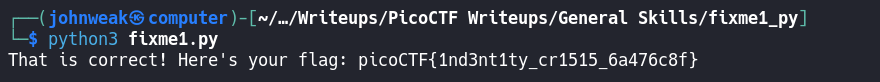

# fixme1.py

## Overview

**Points:** 100\
**Tags:** General Skills, Python

## Description

Fix the syntax error in this Python script to print the flag.\
[Download Python script](./fixme1.py)

## Hints

1. Indentation is very meaningful in Python
2. To view the file in the webshell, do: `$ nano fixme1.py`
3. To exit `nano`, press Ctrl and x and follow the on-screen prompts.
4. The `str_xor` function does not need to be reverse engineered for this challenge.

## Approach

Download the file and see if something's there. You can use any text editor you want: nano, vim, subl, vscode... I will use vscode: `$ code fixme1.py`

```python

import random


def str_xor(secret, key):
    #extend key to secret length
    new_key = key
    i = 0
    while len(new_key) < len(secret):
        new_key = new_key + key[i]
        i = (i + 1) % len(key)        
    return "".join([chr(ord(secret_c) ^ ord(new_key_c)) for (secret_c,new_key_c) in zip(secret,new_key)])


flag_enc = chr(0x15) + chr(0x07) + chr(0x08) + chr(0x06) + chr(0x27) + chr(0x21) + chr(0x23) + chr(0x15) + chr(0x5a) + chr(0x07) + chr(0x00) + chr(0x46) + chr(0x0b) + chr(0x1a) + chr(0x5a) + chr(0x1d) + chr(0x1d) + chr(0x2a) + chr(0x06) + chr(0x1c) + chr(0x5a) + chr(0x5c) + chr(0x55) + chr(0x40) + chr(0x3a) + chr(0x58) + chr(0x0a) + chr(0x5d) + chr(0x53) + chr(0x43) + chr(0x06) + chr(0x56) + chr(0x0d) + chr(0x14)

  
flag = str_xor(flag_enc, 'enkidu')
  print('That is correct! Here\'s your flag: ' + flag)


```

As the hint 1 says, the indentation is very meaning ful in Python. The error is in line 20 when you print the flag out, just put it back to the beginning of the line, save it and try running this script.


## Flag

`picoCTF{1nd3nt1ty_cr1515_6a476c8f}`