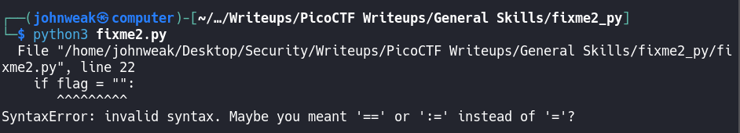
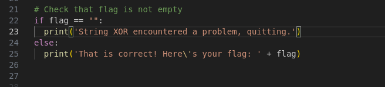
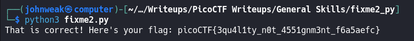

# fixme1.py

## Overview

**Points:** 100\
**Tags:** General Skills, Python

## Description

Fix the syntax error in this Python script to print the flag.\
[Download Python script](./fixme2.py)

## Hints

1. Are equality and assignment the same symbol?
2. To view the file in the webshell, do: `$ nano fixme2.py`
3. To exit `nano`, press Ctrl and x and follow the on-screen prompts.
4. The `str_xor` function does not need to be reverse engineered for this challenge.

## Approach

This challenge is pretty similar to challenge `fixme1.py` you did.

There is an error in this python script. The hint 1 says: `Are equality and assignment the same symbol?`

Did you see the error? It's in line 22.

Fix it and run again.

## Flag

`picoCTF{3qu4l1ty_n0t_4551gnm3nt_f6a5aefc}`