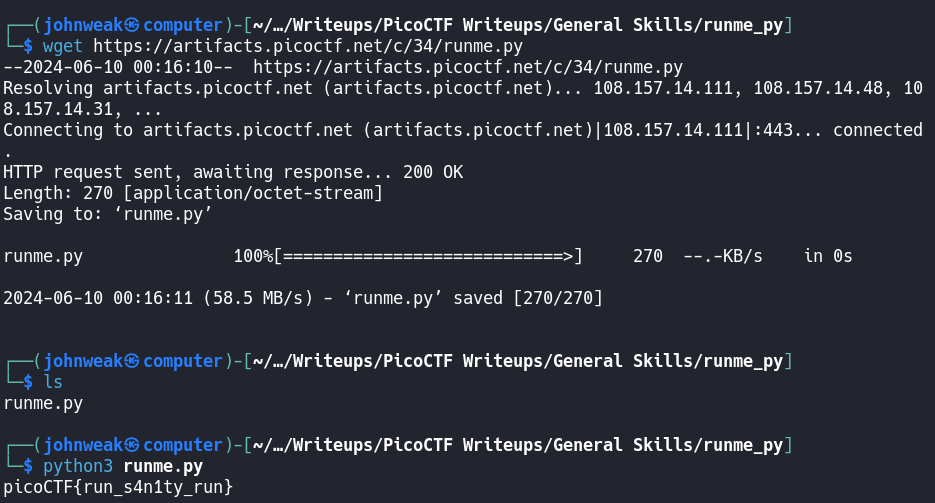

# runme.py

## Overview

**Points:** 100\
**Tags:** General Skills, Python

## Description

Run the `runme.py` script to get the flag. Download the script with your browser or with `wget` in the webshell.\
[Download runme.py Python script](./runme.py)

## Hints

(i don't need hints)

## Approach

This challenge is the basic of the basics, just `wget` runme.py and then run it by `python3`

## Flag

`picoCTF{run_s4n1ty_run}`
