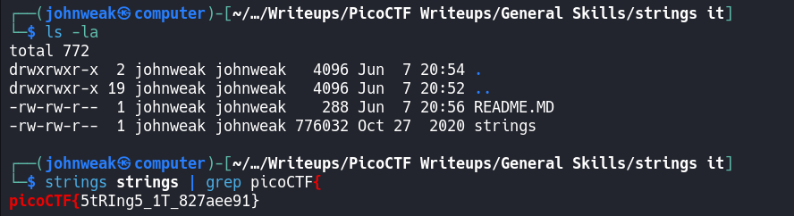

# strings it

## Overview

**Points:** 100\
**Tags:** General Skills

## Description

Can you find the flag in [file] without running it?

## Hints

1. `strings`

## Approach

Did you get the file already? Using `wget` command.\
This is just a basic. So, let's quickly solve it:

Do you remember the uses of `strings` command and `grep` command?
If not, check by using `man [cmd]`

## Flag

`picoCTF{5tRIng5_1T_827aee91}`
