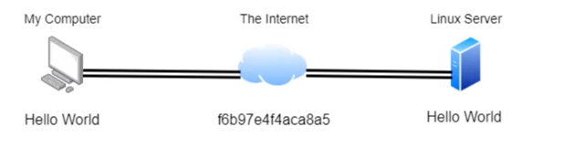
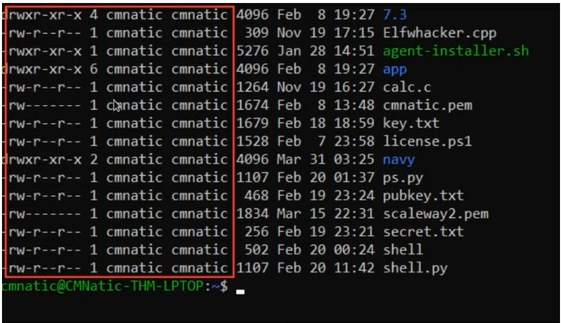
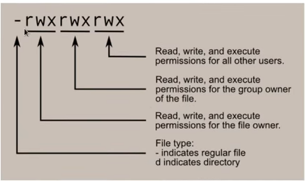

# Linux Fundamentals Part 2

## Accessing your Linux Machine using SSH

a protocol between devices in an encrypted form, allow us to remotely execute commands on another device remotely and any data sent between the devices is encrypted when it is sent over a network (internet).



```bash
$ ssh [username]@[ip]
```

## Some other commands to interact with file system
+ ls, cd, find, grep, ...
+ touch 
+ mkdir
+ cp
+ mv 
+ rm
+ file

with some flags/options: -r, -R, -a

## Permissions 101

using `ls -l` to see the long list format of the current dir:



+ The column 1 show us the type of it and its permissions

  

  the first character also could be `l` shorted for `link` --> mean `symlink`.
+ The column 2 is the number of link that references to it
+ The column 3: user
+ The column 4: group
+ The column 5: size (in byte)

## Switch between users

```bash
$ su [username]
```

+ su: keep most evironment variables and does not change the current dir
+ su -l: reset the environment variables as if it's a new login session and change the current dir to the target user's home dir.

## Common Directories
1. /etc : store system files used by OS
2. /var : store data that if frequently accessed
3. /root: home of **root** system user, unlike /home
4. /tmp: store data that is only needed to be accessed once or twice, is cleared when restarting. 