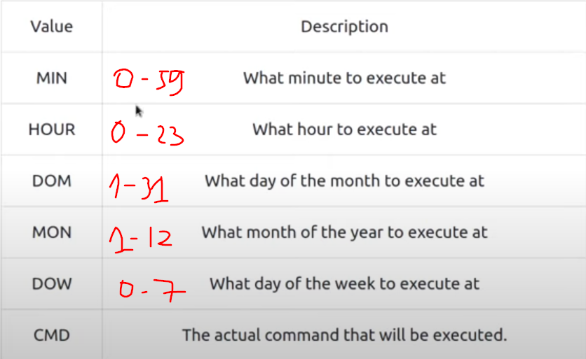

# Linux Fundamentals Part 3

## Terminal Text Editors
+ Nano
+ Vim
## General/Useful Utilities
+ wget
+ scp [src] [dest].
  
  For example: 
  + `$ scp src.txt ubuntu@192.168.1.20:/home/ubuntu/dest.txt`
  + `$ scp ubuntu@192.168.1.20:/home/ubuntu/src.txt dest.txt`

+ python3

## Processes 101

+ ps, ps aux, top
+ kill [PID]

`namespace` to split resource for each process (this resource is isolating) 

+ systemctl [option] [service]

  We have some options: start, stop, enable, disable, restart, status, ...

## Backgrouding and foregrounding in Linux

Processes can run in 2 states: in background (by adding `&` at the end of command) and in foreground (by default)

+ change foreground --> background: `Ctrl + z`
+ change background --> foreground: `fg`

## Maintaining your system: automation

+ scheduling a certain task to take place by using something called `cron` process.

We can interact with it via the use of `crontabs`, it requires 6 values:



For example: 
```bash
0 * 12 * * * cp -R /home/username/Documents /var/backups
```

To edit `crontab` file, we use: `$ crontab -e`

## Maintaining your system: packet management:

+ apt, apt-get
+ dpkg

## Maintaining your system: logs

/var/log