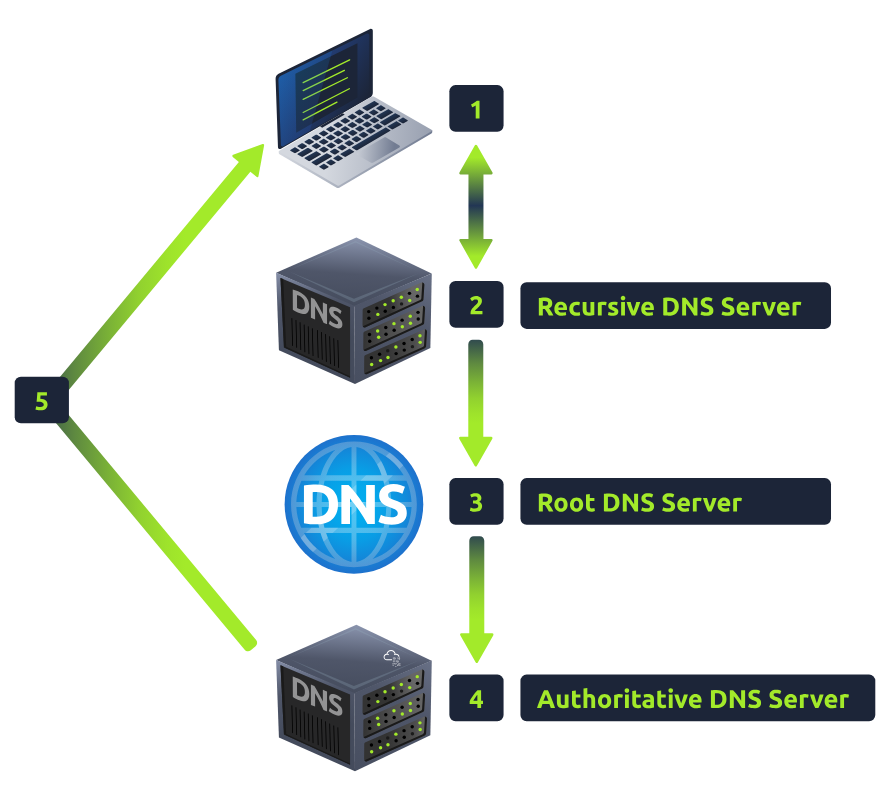

# Introductory Networking

An introduction to networking theory and basic networking tools

## Task 1: Introduction

Topics that we're covering in this room:
+ OSI model
+ TCP/IP model
+ How these models look in practice
+ An introduction to basic networking tools

## Task 2: The OSI Model: An Overview

Open Systems Interconnection

| OSI |
-------
| Application |
| Presentation |
| Session |
| Transport |
| Network |
| Data Link |
| Physical |

+ **Layer 7: Application**
  providing an interface for programs to use in order to transmit data - pass down into the presentation layer

+ **Layer 6: Presentation**
  translate the data into a standardised format, as well as handling any encryption, compression or other transformations to the data.

+ **Layer 5: Session**
  maintain a connection with the other computer across the network - `session`. This is what allows you to make multiple requests to different endpoints simultaneously without all the data getting mixed up (think about opening two tabs in a web browser at the same time).

+ **Layer 4: Transport**
  + Choose protocol over which the data is to be transmitted: TCP or UDP
  + With a protocol selected, the transport layer then divides the transmission up into bite-sized pieces (over TCP these are called `segments`, over UDP they're called `datagrams`), which makes it easier to transmit the message successfully. And then transmit them.

+ **Layer 3: Network**
  This layer is responsible for locating the destination of your request (`logical addressing - IP address`).

+ **Layer 2: Data Link**
  + This layer focuses on `the physical addressing - MAC`. Inside every network enabled computer is a Network Interface Card (NIC) which comes with a unique MAC to identify it.
  + This layer also servers an important function when it receives data: check the received info to make sure that it hasn't been corrupted during transmission by layer 1

+ **Layer 1: Physical**
  this layer is right down to the hardware of the computer: electrical pulses, convert binary data into signals and transmit them across the network as well as converting them back into binary data when receiving. --> `transmit and receive data`.

## Task 3: Encapsulation


encapsulation and de-encapsulation

## Task 4: The TCP/IP Model

real-world networking

The TCP/IP model consists of 4 layers:

| **TCP/IP** |
-------------
| Application |
| Transport |
| Internet |
| Network Interface |

**Note**: Some recent sources split the TCP/IP model into five layers -- breaking the Network Interface layer into Data Link and Physical layers (as with the OSI model). This is accepted and well-known but it's not officially defined.

The 2 models match up something like this:


> The TCP/IP model = TCP protocol + IP protocol

+ TCP protocol is a *connection-based* protocol. In other words, before you send any data via TCP, you must first form a stable connection between the 2 computers. The process of forming this connection is called the *three-way handshake*


---


**Question**
1. Which model was introduced first, OSI or TCP/IP?
    <details>
      <summary>Click here to reveal the answer</summary>
      TCP/IP
    </details>
2. Which layer of the TCP/IP model covers the functionality of the Transport layer of the OSI model?
    <details>
      <summary>Click here to reveal the answer</summary>
      Transport
    </details>
3. Which layer of the TCP/IP model covers the functionality of the Session layer of the OSI model?
    <details>
      <summary>Click here to reveal the answer</summary>
      Application
    </details>
4. The Network Interface layer of the TCP/IP model covers the functionality of 2 layers in the OSI model. These layers are Data Link, and? 
    <details>
      <summary>Click here to reveal the answer</summary>
      Physical
    </details>
5. Which layer of the TCP/IP model handles the functionality of the OSI network layer?
    <details>
      <summary>Click here to reveal the answer</summary>
      Internet
    </details>
6. What kind of protocol is TCP?
    <details>
      <summary>Click here to reveal the answer</summary>
      Connection-based
    </details>
7. What is SYN short for?
    <details>
      <summary>Click here to reveal the answer</summary>
      Synchronise
    </details>
8. What is the second step of the three way handshake?
    <details>
      <summary>Click here to reveal the answer</summary>
      SYN/ACK
    </details>
9. What is the short name for the "Acknowledgement" segment in the three-way handshake?
    <details>
      <summary>Click here to reveal the answer</summary>
      ACK
    </details>

## Task 5: Networking Tools - Ping

```bash
$ ping [target]
```


Ping works using the ICMP protocol on the Internet layer.
Any questions about syntax can be answered using the man page for ping (`man ping` on Linux)

## Task 6: Networking Tools - Traceroute

```bash
$ traceroute [dest]
```
By default, the Windows traceroute utility (`tracert`) operates using the same ICMP protocol that ping utilises, and the Unix equivalent operates over UDP.


Read more in man page: `man traceroute`

## Task 7: Networking Tools - WHOIS

```bash
$ whois [domain]
```

get the list of available information about the domain registration.


## Task 8: Networking Tools - Dig

How a URL gets converted into an IP address that your computer can understand? --> **DNS** (Domain Name System)

DNS allows us to ask the special server to give us the IP address of the website we're trying to access.

---
Break this down a bit

1. Request [tryhackme.com](https://tryhackme.com/dashboard)
2. Check local cache (in **hosts file**) for IP address 
3. Check your recursive DNS Server for address
4. Query Root Server to find Authoritative DNS Server
5. Authoritative DNS Server advises the IP address for the website
6. Request pass through a WAF - Web Application Firewall
7. Request pass through a Load Balancer
8. Connect to Webserver on port 80 or 443
9. Web server receives the GET request 
10. Web application talks to Database
11. Your browser renders the HTML into a viewable website.




Read [here](../../../Pre%20Security/How%20the%20web%20works/) to know more.

---

When you visit a website in your browser, this all happens automatically.

But you can do it manually with a tool called `dig`.

> Dig allow us to manually query recursive DNS Server of our choice for information about domains:

```bash
$ dig [domain] @[dns-server-ip]
```


Notice in ANSWER SECTION: 
+ column 2 is TTL (Time To Live) of the queried DNS record. It means the record will expire in `157s`.
+ column 4 is the IP address for the domain we queried. 

It's very useful tool for network troubleshooting.