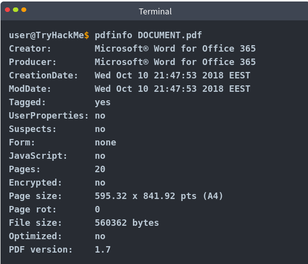
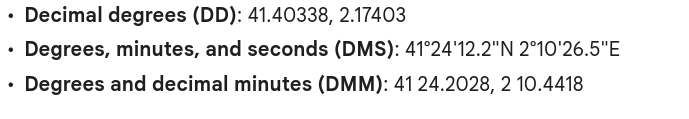

# Intro to Digital Forensics


Learn about digital forensics and related process and experiment with a practical example

## Task 1: Introduction to Digital Forensics


Forensics is the application of science to investigate crimes and establish facts. With the use and spread of digital systems, such as computers and smartphones, a new branch of forensics was born to investigate related crimes: **computer forensics**, which later envolved into, `digital forensics`.

+ How should the police collect digital evidence, such as smartphones and laptops? What are the procedures to follow if the computer and smartphone are running?
+ How to transfer the digital evidence? Are there certain best practices to follow when moving computers, for instance?
+ How to analyze the collected digital evidence? Personal device storage ranges between tens of gigabytes to several terabytes; how can this be analyzed?


Which device can help the investigation?

--> digital devices and digital media include: 
+ tablet, smartphone, digital camera, USB flash memory, computer, ...

> Digital forensics is the application of computer science to investigate digital evidence for a legal purpose.

Digital forensics is used in 2 types of investigations:
1. **Public-sector Investigations**: carried out by government and law enforcement agencies. They would be part of a crime or civil investigation.
2. **Private-sector Investigations**: carried out by corporate bodies by assigning a private investigator, whether in-house or outsourced. They are triggered by corporate policy violations.


## Task 2: Digital Forensics Process


The basic plan goes as follows:
1. Acquire the evidence: collect the digital devices such as laptops, storage devices, and digital cameras. Laptops and computers require special handling if they are turned on.
2. Establish a **chain of custody**
3. Place the evidence in a secure container
4. Transport the evidence to your digital forensics lab


At the lab, the process goes as follows:
1. Retrieve the digital evidence from the secure container
2. Create a forensic copy of the evidence to avoid modifying the original data
3. Return the digital evidence to the secure container, work on the copy
4. Start processing the copy on your forensics workstation

The process includes:
+ Proper search authority
+ Chain of custody
+ Validation with mathematics
+ Use of validated tools
+ Repeatability
+ Reporting

## Task 3: Practical Example of Digital Forensics

Download task file [here](./ransom-lettter-2-1645608985174.zip)

If the document requires in MS Word Document format, we can convert the document to PDF format and extract the image from the MS Word file for your convenience.

Using `unzip [file]` to unzip it in current directory.

### Document Metadata

When you create a text file, `txt`, some metadata gets saved by the Operating System, such as file creation date and last modification date. However, much info gets kept within the file's metadata when you use a more advanced editor, such as `MS Word`. 

There are various ways to read the file metadata, one of them is using a suitable forensic tool.

**Note**: exporting the file to other formats, such as `PDF` would maintain most of the metadata of the original document, depending on the PDF writer used.

We will try to read the metadata using `pdfinfo`. It will display various metadata related to a PDF file (title, subject, author, creator, creation data, ...)

```bash
$ pdfinfo [DOCUMENT_NAME].pdf
```



### Photo EXIF Data

EXIF stands for Exchangeable Image File Format; it is a standard for saving metadata to image files. 

Whenever you take a photo with your smartphone or with your digital camera, plenty of information gets embedded in the image. Some examples of metadata that can be found in the original digital images:
+ Camera model/Smartphone model
+ Data and time of image capture
+ Photo settings such as focal length, aperture, shutter speed, and ISO settings.

Because smartphones are equipped with a GPS sensor, finding GPS coordinates (latitude and longitude) embedded in the image is highly probable. The GPS coordinates would generally show the place where the photo was taken.

There are many online/offline tools to read the EXIF data from images. One command-line tool is `exiftool`

```bash
$ exiftool [IMAGE_NAME].jpg
```

Need to convert GPS coordinates from (degrees, minutes, seconds - **DMS**) form to (Decimal Degrees - DD) form or (Degrees and decimal minutes - DMM) in order to input on search box of gg map.

Example: 



Search more on Google.