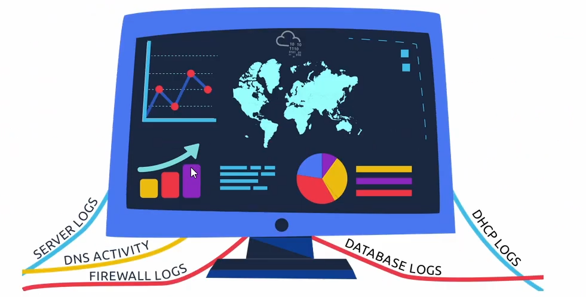

# Security Operations

Learn about **Security Operations Center (SOC)**: its responsibilities, services, and data sources.

## Task 1: Introduction to Security Operations

A **Security Operations Center (SOC)** is a team of IP security professionals tasked with monitoring a company's network and systems 24 hours a day, 7 days a week. The purpose of monitoring is to:
+ Find vulnerabilities on the network
+ Detect unauthorized activity
+ Discover policy violations
+ Detect intrusions
+ Support with the incident response

## Task 2: Elements of Security Operations

### Data Sources

The SOC use many data sources to monitor the network for signs of intrusions and to detect any malicious behaviour:
+ Server logs
+ DNS Activity
+ Firewall logs
+ DHCP logs

A SOC might use **Security Information and Event Management (SIEM)** system to aggregate the data from the different sources so that the SOC can efficiently correlate the data and respond to attacks.

### SOC Services

include reactive and proactive services in addition to other services.

1. Reactive services refer to the tasks initiated after detecting an intrusion or a malicious event:
+ Monitor security posture: monitoring the network and computers for security alerts and notifications and responding to them as the need dictates.
+ Vulnerabilities Management
+ Malware Analysis
+ Intrusion Detection
+ Reporting
2. Proactive services refer to tasks handled by the SOC without any indicator of an intrusion:
+ Network security monitoring
+ Threat hunting
+ Threat intelligence

### Example Scenario

SOC analyst is responsible for network security monitoring and log management.

## Task 3: Practical Example of SOC

use firewall to stop an ongoing attack