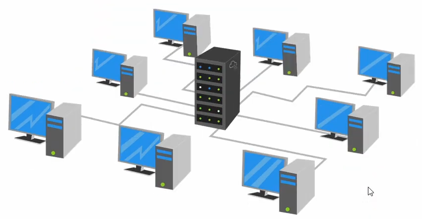
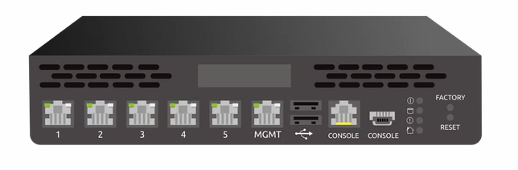
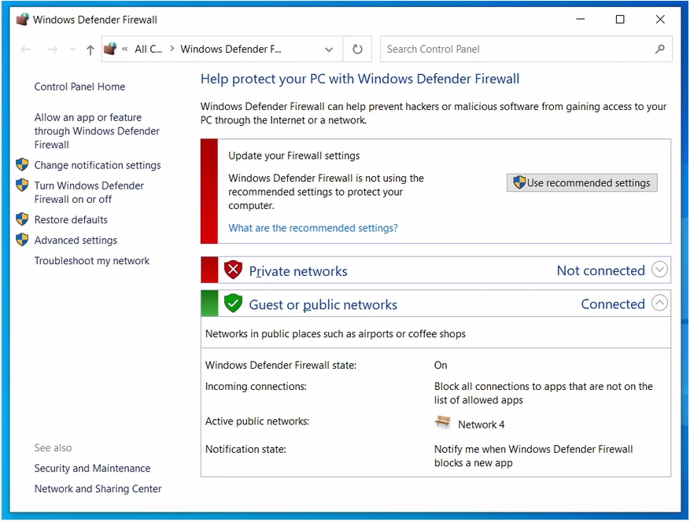
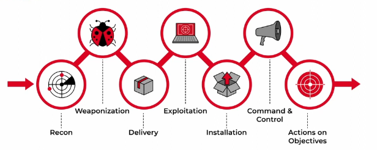
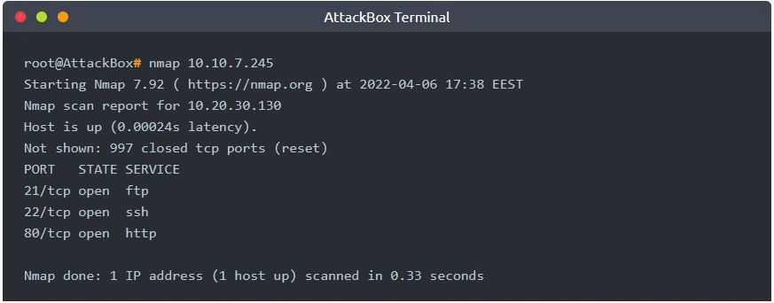

# Network Security

Learn about network security, understand attack methodology, and practice hacking into a target server.

## Task 1: Introduction

A computer network is a group of computers and devices connected with each other. Network security focuses on protecting the security of these devices and the links connecting them. (protect the confidentiality, integrity and availability of a computer network and the data on it)



**Examples of hardware appliances include**:
+ Firewall appliance: The firewall allows and block connections based on a pre-defined set of rules.
+ Intrusion Detection System (IDS) appliance: An IDS detects system and network intrusions and intrusion attempts. It tries to detect attacker's attempts to break into your network.
+ Intrusion Prevention System (IPS) appliance: An IPS blocks detected intrusion and intrusion attempts. It aims to prevent attackers from breaking into your network.
+ Virtual Private Network (VPN) concentrator appliance: A VPN ensures that `the network traffic cannot be read not altered by a third party`. It protects the confidentiality (secrecy) and integrity of the sent data.




**On the other hand, we have software security solutions. Common examples are:**

+ Antivirus software
+ Host firewall: Unlike firewall appliance - a hardware device, a host firewall is a program that ships as part of your system, or it is a program you install on your system: Windows Defender Firewall



## Task 2: Methodology

Every "operation" requires some form of planning to achieve success.



Breaking into a target network usually includes a number of steps. According to **Lockheed Martin**, the Cyber Kill Chain has seven steps:
1. **Recon**: short for reconnaissance, refers to the step where the attacker tries to `learn as much as possible about the target`. Information such as the types of servers, OS, IP, names of users, and email addresses, can help the attack's success.
2. **Weaponization**: This step refers to preparing a file with a malicious component, for example, to provide the attacker with remote access.
3. **Delivery**: means delivering the "weaponized" file to the target via feasible method, such as mail or USB flash memory.
4. **Exploitation**: when the users open the malicious file, their system executes the malicious component.
5. **Installation**: the previous step should install the malware on the target system.
6. **Command and Control (C2)**: The successful installation of the malware provides the attacker with a command and control ability over the target system.
7. **Actions on Objectives**: After gaining control over one target system, the attacker has achieved their objectives. One example objective is **Data Exfiltration** (stealing target's data).

## Task 3: Practical Example of Network Security

The first step of our attack is **Recon**, we can speed up it using different tools. For this example, we will use `Nmap`, short for Network Mapper.



3 services running:
+ FTP server
+ SSH server
+ HTTP server

Let's try to gather more info about the FTP server:
  1. Connect to the target FTP serser by `ftp [IP target]`
  2. Try to log in using the login `anonymous` to see if this FTP supports anonymous logins. It will work in this case `:))`
  3. Exploit more, using `get [file name]` to download the file you want
  4. Once you download the file, type `exit` or `bye` to quit the FTP client.

```bash
$ ssh [username]@[ip address]
```

ls, cat, cd