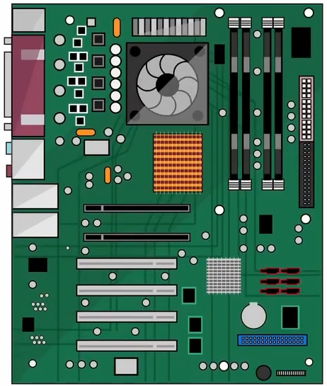
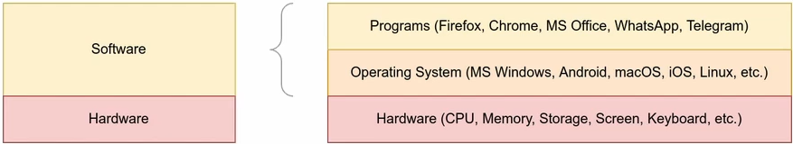
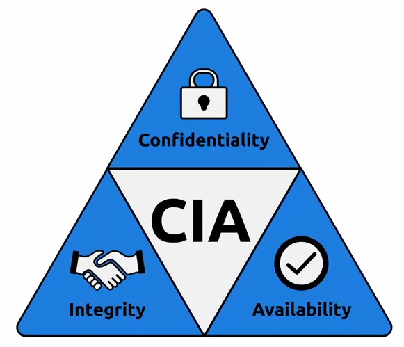

# Operating System Security

This room introduces users to operating systems security and demonstrates SSH authentication on Linux

## Task 1: Introduction ot Operating System Security

MS Windows, macOS, iOS, Android, Chrome OS, Linux.

What is OS? To define an Operating System, we need to visit one computer term: **hardware**.

screen, keyboard, printer, USB flash memory, desktop board(main board), CPU, RAM, HDD/SSD

The desktop board (main board) is the main part of a computer, and all pieces of hardware connect to it. However, we need an Operating System to control and "drive" them.

The OS is the layer between the hardware and the applications and programs you're running.

Your smartphone might be running Android or iOS. And you might have plenty of private data on it: private conversations, private photos, email, password, e-banking apps,...

And you don't want someone you don't trust to open your phone and go through your photos, conversations, and apps. You need to secure your phone and its operating system.

The same goes for your laptop or computer. And the list can get very long. And considering the nature of the saved data, you want to ensure that your data is secure.

When we talk about security, we should think of protecting 3 things:
+ Confidentiality: ensure that secret and private files and info are only available to intended person.
+ Integrity: on one who doen't have permissions can tamper with the files stored on your system or while being transferred on the network
+ Availability: want your laptop or smartphone to be available to use anytime you decide to use it.

## Task 2: Common Example of OS Security

Security is concerned with attacks against:
1. Confidentiality
2. Integrity
3. Availability

In this room, we'll focus on three weaknesses targeted by malicious users:
1. Authentication and Weak Passwords
2. Weak Files Permission
3. Malicious Programs

### Authentication and Weak Passwords

Authentication is act of verifying your identity. It can be achieved via 3 ways:
+ Something you know: password, PIN code
+ Something you are: a fingerprint
+ Something you have: phone number via which you can retrieve an SMS message

Since passwords are the most form of authentication, they are also the most attacked. Many users tend to use easy-to-guess passwords or the same password on many websites. Moreover, some users rely on personal details such as date of birth and name of their pet, thinking that this is easy to remember and unknown to attackers. However, attackers are aware of this tendency among users.

[Top 100,000 most common passwords](https://lucidar.me/en/security/list-of-100000-most-common-passwords/)

123, 1234, 12345, ...123456789, 1234567890\
password, iloveyou, monkey, dragon\
qwerty, qwertyuiop, 1q2w3e4r5t

These seemingly complex passwords are very predictable as they follow the keyboard layout.

In brief, it is vital that you choose complex passwords and use different passwords with different accounts

### Weak File Permissions

`the principle of least privilege = "who can access what?"`

Weak file permissions make it easy for the adversary to attack confidentiality and integrity. They can attack confidentiality as weak permissions allow them to access files they should not be able to access. Moreover, they can attack integrity as they might modify files that they should not be able to edit.

### Access to Malicious Programs

Depending on the type of malicious program, it can attack confidentiality, integrity, and availability.

Trojan horses give the attacker access to your system. Consequently, the attacker would be able to read your files or even modify them.

Ransomware is a malicious program that encrypts the user's files, make them unreadble without knowing the encryption password (which will give user if the user is willing to pay the "ransom")

## Task 3: Practical Example of OS Security

+ whoami
+ ssh USERNAME@IP_ADDRESS
+ ls
+ cat FILENAME
+ history --> data stored in ~/.zsh_history
+ cd 

+ su [options] [username] 