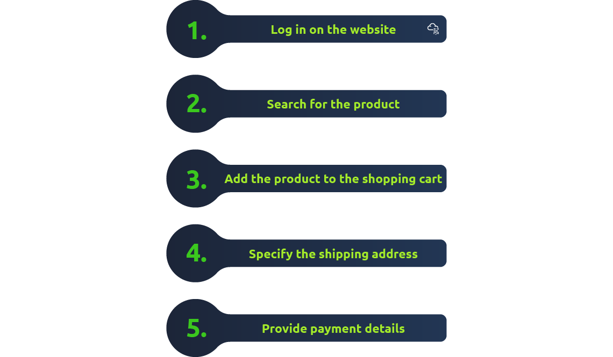

# Web Application Security

Learn about web applications and explore some of their common security issues.

## Task 1: Introduction

Normal programs on our computers run by using out computer's processing power and storage, and we need to install it first.

Web application is like a "program" that we can use without installation as long as we have a modern standard web browser.

Some examples of web apps:
+ webmail
+ online office suites: microsoft office 365
+ online shopping
+ online banking
...

The idea: it is a program running on a remote server to serve the clients. The server will run a specific type of program that can be accessed by web browsers.

A database server is responsible for many functions, including reading, searching, and writing to the database. We can already see amount of info stored in any online system. Suppose an attacker manages to exploit (hack) the web app and steal the customer's database, this will lead to a significant loss for the company and its customers.

And from the user's perspective, they will only access an elegant online shop where all the technical infrastructure is hidden.

Many companies offer bug bounty program which is a reward for anyone who discovers a security vulnerability in their company's systems. 

**Question**

1. What do you need to access a web application?
    

      
Click here to reveal the answer

      Browser
    

## Task 2: Web Application Security Risks

Let's say that you want to buy an item from an online shop. There are certain functions that are able to do on this web application:

There are a few main categories of common attacks:

+ Log in at the website: the attacker can try to discover the password by trying many words. The attacker would use a long list of passwords with an automated tool to test them against the login page.

+ Search for the product: The attacker can attempt to breach the system by adding specific characters and codes to the search term for the target system to return data it should not or execute a program it should not.

+ Provide payment details: The attacker would check if the payment details are sent in cleartext (plain text) or using weak encryption.

We cannot cover everything, but we will present a few formal categories from **OWASP Top Ten**. 

4 categories:

### Identification and Authentication Failure

- Identification refers to the ability to identify a user uniquely.
- In contrast, authentication refers to the ability to prove that the user is whom they claim to be.

Online system must confirm the user's identity and authenticate them before allow them to use the system.

Weakness can be:
+ Allowing the attacker to use brute force: try many passwords with using automated tool to find valid login credentials.
+ Allowing the user to choose a weak password that is usually easy to guess
+ Storing the user's passwords in plain text. The attacker can manage to read the file containing the passwords.

### Broken Access Control

Access Control: each user can only access file (docs, imgs, ...) related to their role or work.

For example, you don't want someone in the marketing department to access the finance department's documents. Example vulnerabilities related to access control include:
+ Failing to apply *the principle of the least privilege* and give users more access permissions than they need.
+ Being able to view or modify someone else's account by using its unique idnetifier (ex: view transactions of another client).
+ Being able to browse pages that require authentication (logging in) as an unauthenticated user (ex: be able to view the webmail before logging in)

### Injection

An injection attack refers to a vulnerability in the web application where the user can insert malicious code as part of their input. One cause of this vulnerability is the lack of proper validation and sanitization of the user's input.

### Cryptographic Failures

Cryptography focuses on the processes of encryption and decryption of data. 

+ encryption: plaintext --> ciphertext
+ decryption: ciphertext --> plaintext 

Examples of cryptographic failures include:
+ Sending sensitive data in plaintext. For example, using HTTP instead of HTTPS, others can read everything you send over HTTP, but not HTTPS.
+ Reply on a weak cryptographic algorithm (ex: shifting encryption)
+ Using default or weak keys for cryptographic functions. 

**Questions**
1. You discovered that the login page allows an unlimited number of login attempts without trying to slow down the user or lock the account. What is the category of this security risk?
    

        
Click here to reveal the answer

        Identification and Authentication Failure
    

2. You noticed that the username and password are sent in cleartext without encryption. What is the category of this security risk?
    

        
Click here to reveal the answer

        Cryptographic Failures
    

## Task 3: Practical Example of Web Application Security

This task will investigate a vulnarable website that uses **Insecure Direct Object References (IDOR)**. IDOR falls under the category of **Broken Access Control** - an attacker can access info or perform actions not intended for them. 

In this case, a web server receives user-supplied input to retrieve objects (files, data, doc, ...) ***that are numbered sequentially***.

If the user has permission to access a photo named `IMG_1003.JPG`, we might guess that there are also `IMG_1002.JPG` and `IMG_1004.JPG`. However, the web app should not provide us with that image even if we figured out its name.

> An IDOR vulnerability can occur if too much trust has been placed on that input data (URL). 
>
> In other words, the web app does not validate whether the user has permission to access the requested object.

More examples:
+ `https://store.com/customers/user?id=16` would return the user with `id=16`. We expect the users to have sequential ID numbers and try other numbers and possibly access other user accounts.

**Question**
1. Check the other users to discover which user account was used to make the malicious changes and revert them. After reverting the changes, what is the flag that you have received?
    

        
Click here to reveal the hint

        THM{IDOR_EXPLORED} 
    
