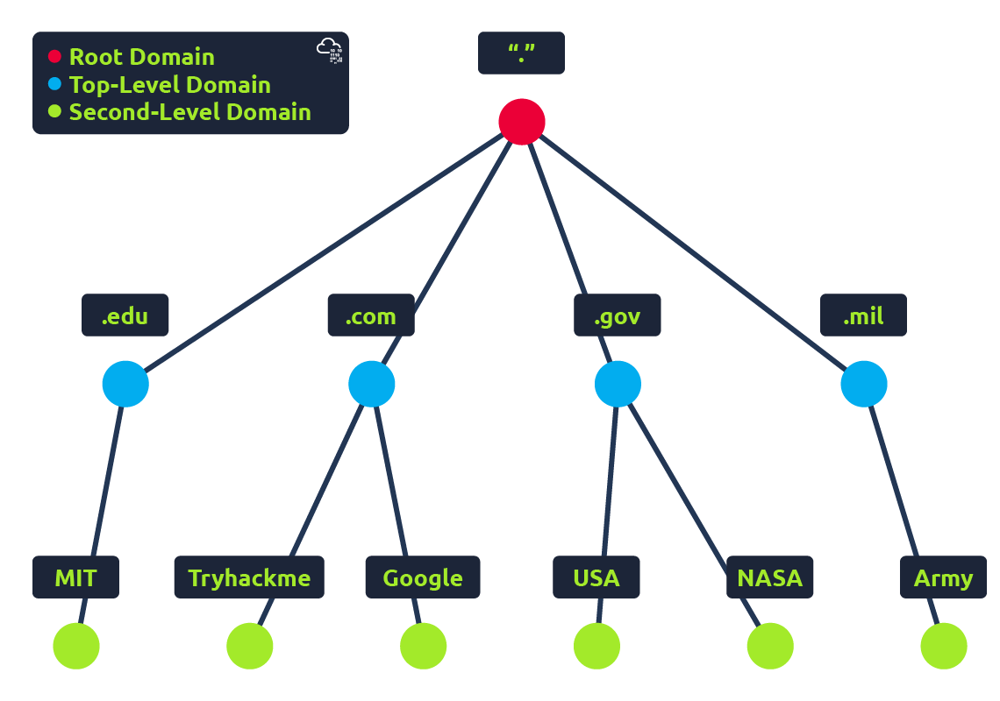
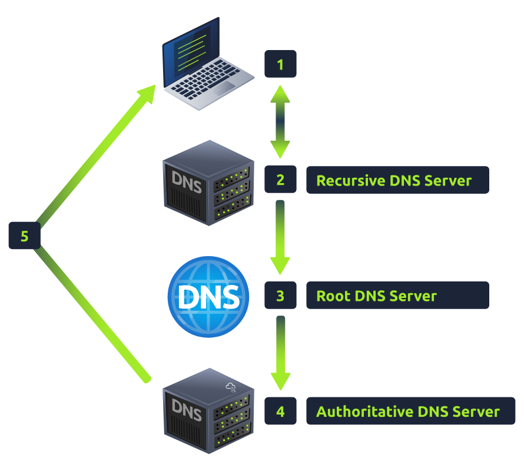
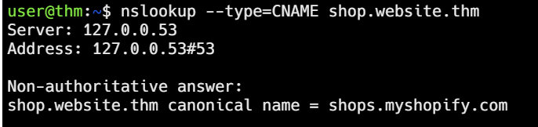

# DNS in detail

Learn how DNS works and how it helps you access internet services.

## Task 1: What is DNS?

**Domain Name System** provides a simple way for us to communicate with devices on the internet without remembering complex numbers.

`Every computer on the internet` has its own unique address to communicate with it called **IP address**. But it's not exactly convenient to remember this complicated set of numbers.

--> DNS can help! Instead of remembering 104.26.10.229, you can remember tryhackme.com instead.

## Task 2: Domain Hierarchy

### TLD (Top-Level Domain)

A TLD is the most righthand part of a domain name. Ex: the `tryhackme.com` TLD is **.com**.

There are 2 types of TLD: 
+ **gTLD** (Generic Top Level) --> refer to the domain name's purpose. 
    `.com`, `.org`, `.edu`, .`.gov` ...
+ **ccTLD** (Country Code Top Level Domain) was used for geographiccal purposes.

## Second-Level Domain

the second-level domain of `tryhackme.com` is **tryhackme**

the second-level domain is limited to **63** characters + the TLD and can only use a-z 0-9 and hyphens (cannot start or end with hyphens or have consecutive hyphens).

## Subdomain

On the left-hand side of the Second-Level Domain, using a period to separate it. A subdomain name the same creation restrictions as a second-level domain.

Can use multiple subdomains split with periods 

But **the length of a domain name must be kept to 253 characters or less.**

**Note:** www.google.com --> `www` is the subdomain, `google` is the second-level domain and `com` is the TLD

**Questions**
1. What is the maximum length of a subdomain?
    

        
Click here to reveal the answer

        63
    

2. Which of the following characters cannot be used in a subdomain (3 b _ -) ?
    

        
Click here to reveal the answer

        _
    

3. What is the maximum length of a domain name?
    

        
Click here to reveal the answer

        253
    

4. What type of TLD is .co.uk?
    

        
Click here to reveal the answer

        ccTLD
    

## Task 3: Record Types

**DNS Record Types**: 

- A Record: resolving to IPv4 addresses.
- AAAA Record: resolving to IPv6
- CNAME Record: resolving to another domain name. For example: TryHackMe's online shop has the subdomain name *store.tryhackme.com* which returns a **CNAME record** *shops.shopify.com*. **Another DNS request** would then be made to shops.shopify.com to work out the IP address.
- MX Record: resolving to the address of the servers that handle the email for the domain you're querying.
- TXT Record: free text fields, having multiple uses but some common ones can be to list servers that have `the authority to send an email on behalf of the domain`. Or to verify ownership of domain name when signing up for third party services.

## Task 4: Making A Request

**What happens when you make a DNS request**
1. first check computer's local cache to see if you've previously looked up the address recently. If not, a request to your `Recursive DNS Server` will be made.
2. `Recursive DNS Server` is usually provided by your ISP, but you can also choose your own. This server also has a local cache of recently looked up domain names. 
   1. If found, the IP address will sent back to your computer. 
   2. If not, send a request to **Root DNS Server**
3. The root servers act as the DNS backbone of the Internet, responsible to redirect you to the correct TLD Server.
4. The TLD server holds records for where to find **the authoritative server** to answer the DNS request. 
5. **The authoritative DNS server** stores the DNS records for a particular domain name, then send back to the Recursive DNS server. Here, a local copy will be cached for future requests and then relayed back to the original client that made the request.

DNS records all come with a TTL value (in seconds) that the response should be saved for locally until you have to look it up again. 

**Questions**
1. What field specifies how long a DNS record should be cached for?
    

        
Click here to reveal the answer

        TTL
    

2. What type of DNS Server is usually provided by your ISP?
    

        
Click here to reveal the answer

        Recursive
    

3. What type of server holds all the records for a domain?
    

        
Click here to reveal the answer

        Authoritative
    

> You can use a command-line tool called **nslookup** to see the information of a domain name.
>
> 
