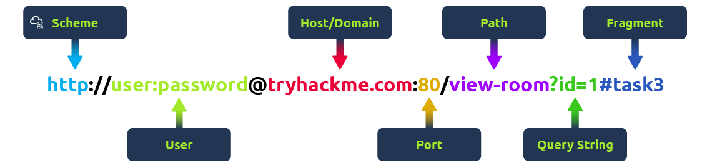
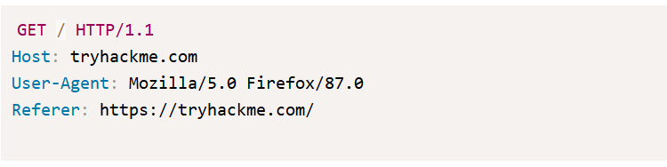
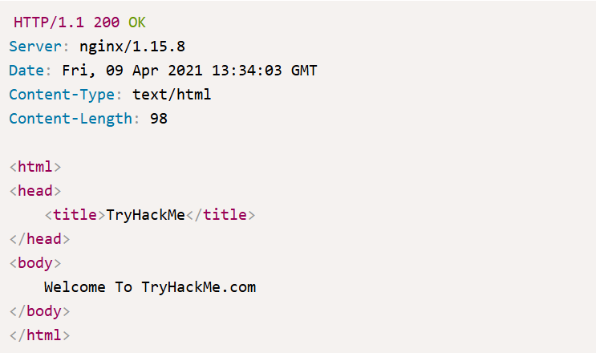
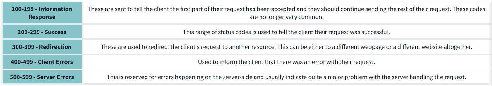
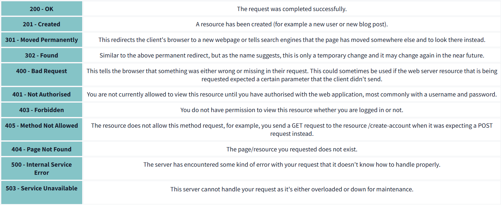

# HTTP in Detail

Learn about how you request content from a web server using the HTTP protocol

## Task 1: What is HTTP(S) ?

HyperText Transfer Protocol

HTTP is what's used whenever you view a website, is the set of rules used for communicating with web servers for transmitting of webpage data (text, images, videos, ...)

HTTPS is the secure version of HTTP, encrypting data before transmitting it.

## Task 2: Requests And Responses

**What is a URL? (Uniform Resource Locator)**

+ Scheme: what protocol to use.
+ User: some services require authentication to log in, you can put a username and password into the URL to log in
+ Host: the domain name or IP address of the server
+ Port: the port that you're going to connet to (80 for HTTP and 443 for HTTPS)
+ Path: the file name or location of the resource you're trying to access
+ Query String
+ Fragment: a reference to a location on the actual page requested.

**Making a Request**

Example request:

+ line 1: `GET` method , request the home page with `/` and telling the web server we're using HTTP protocol version 1.1
+ line 2: what we want
+ line 3: tell the web server we're using the Firefox version 87 Browser
+ line 4: referer
+ line 5: always ending with a blank line.

Example Response:

+ line 1: HTTP 1.1 is the version of the HTTP protocol the server is using and then the HTTP Status Code.
+ line 2: the web server software and version number
+ line 3: current date, time and timezone of the web server
+ line 4: content-type
+ line 5: content-length to confirm no data is missing.
+ line 6: HTTP response contains a blank line to confirm the end of HTTP response
+ the rest is the information that has been requested.

## Task 3: HTTP Methods

+ GET Request: getting information from web server
+ POST Request: submitting data to creating new records (form)
+ PUT Request: submitting data to update information
+ DELETE Request: deleting information/records from web server.

## Task 4: HTTP Status Codes

Common Status Code:

## Task 5: Headers

### Common Request Headers:

+ Host: some web servers host multiple websites, so by providing the host headers you can tell it which one you require, otherwise you'll just receive the default website for the server.
+ User-Agent: your browser software and version number.
+ Content-Length
+ Accept-Encoding
+ Cookie
  
## Common Response Headers
+ Set-Cookie
+ Cache-Controle
+ Content-Type
+ Content-Encoding

## Task 6: Cookie

We need cookie because HTTP is stateless (doesn't keep track of your previous requests), cookies can be used to remind the web server your info.

Can be used for many purposes but are most commonly used for web authentication. The cookie value won't usually be a clear-text string, but a token.

Cookies are saved on your computer when you receive a `Set-Cookie` header from a web server. 