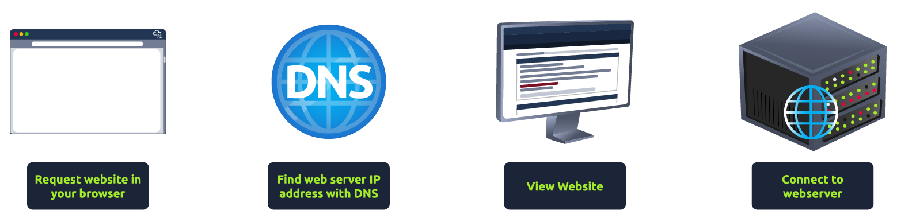
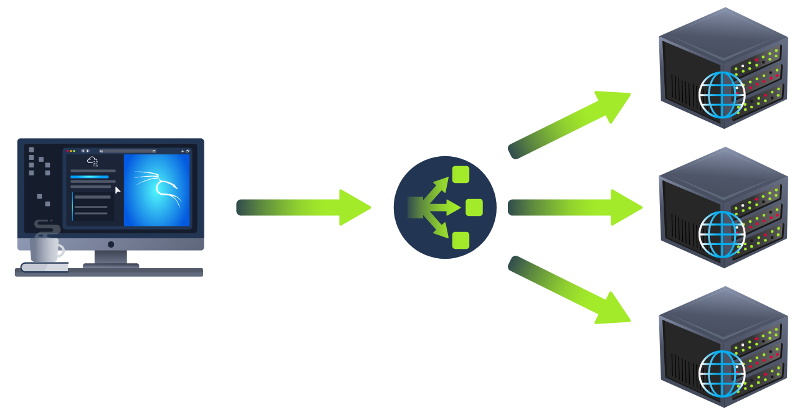

# Putting it all together

Learn how all the individual components of the web work together to bring you access to your favourite web sites

## Task 1: Putting it all together

1. Need to know the server's IP address
2. Talk to the web server using HTTP protocol 
3. The webserver returns HTML, JavaScript, CSS, ... which your browser then uses to correctly format and display the website to you.

## Task 2: Other Components

+ Load Balancers: perform **health check** to ensure each server is running correctly.
    

+ CDN (Content Delivery Network): used to host static files and speed up a client visit to a website.
+ Databases
+ WAF (Web Application Firewall): help against the hacking of a website.

## How Web Servers Work

### What is a Web Server?

A software, listening for incoming connections and then utilises the HTTP protocol to deliver web content to its clients from what's called its **root directory**.

For example, if you request `https://www.example.com/picture.jpg`, it would send the file `/var/www/html/picture.jpg` from its local hard drive if web server using Nginx or Apache...

Most common web server software: Apache, Nginx, IIS, NodeJS.

### Virtual Hosts

Web servers can host multiple websites with different domain names. To achieve this, they use **virtual hosts**.

The we server software checks the hostname being requested from the HTTP headers and matches that against its virtual hosts (text-based configuration files). 

If it finds a match, the correct website will be provided. If no match is found, the default website will be provided instead.

There's no limit to the number of different websites you can host on a web server.

### Static & Dynamic Content

### Scripting and Backend Languages

PHP, Python, Ruby, NodeJS, Perl and many more.

Client cannot see the backend code.

## Summary

The activities behind the scene:

1. Request tryhackme.com in your browser
2. Check local cache for IP address
3. Check your recursive DNS Server for address
4. Query root server to find authoritative DNS Server
5. Authoritative DNS Server advises the IP address for the website
6. Request pass through a WAF
7. Request pass through a Load Balancer
8. Connect to Web server on port 80 or 443
9. Web server receives the GET request
10. Web Application talks to Database
11. Your browser renders the HTML into a viewable website.