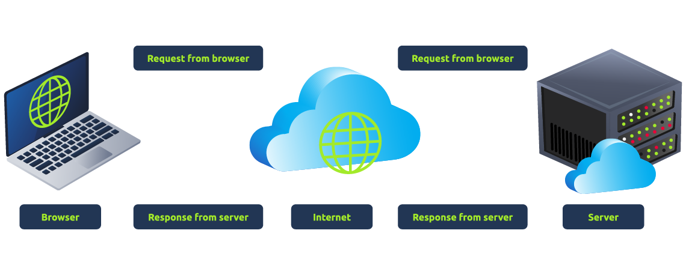
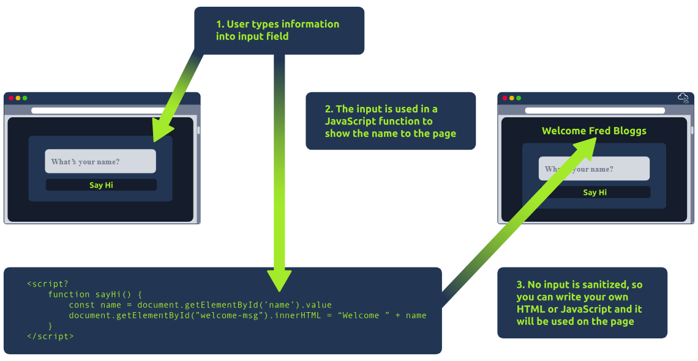

# How Websites Work

To exploit a website, you first need to know how they are created

## Task 1: How websites work

When visiting a website, your browser makes a request to a web server asking for infor about the page. It will respond with data that your browser uses to show you the page. 

There are 2 major components that make up a website:

1. Front End (client-side) - the way your browser renders a website
2. Back End (server-side) - a server that processes your request and returns a response.

## Task 2: HTML

Websites are primarily created using:
+ `HTML` to build websites and define their structure
+ `CSS` to make websites look pretty by adding styling options
+ `JavaScript`, implement complex features on pages using interactivity

View the HTML of any website by right-clicking and selecting `View Page Source` or something like that.

## Task 3: JavaScript

allows pages to become interactive.

control the functionality of web pages.

## Task 4: Sensitive Data Exposure

occuring when a website doesn't properly protect (or remove) sensitive clear-text info to ther end-user.

usually found in a site's fronted source code. Maybe a comment about a test account which developer forgot removing.

## Task 5: HTML Injection

a vulnerability that occurs when unfiltered user input is displayed on the page. (this is client-side)

--> An attacker can use this vulnerability control the page's appearance and functionality.

It can be used to log the information of other users such as account, bank, .... or can be inject a malicious link into the website. 

