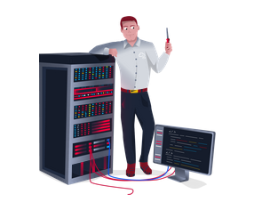

# Careers in Cyber
Learn about the different careers in cyber security

## Task 1: Introduction

There are many different jobs within the security industry, from **offensive pentesting** (hacking machines and reporting on vulnerabilities) to **defensive security** (defending against and investigating cyberattacks).

Why get a career in cyber:
- High Pay
- Exciting 
- Be in demand.

## Task 2: Security Analyst

Responsible for maintaining the security of an organisation's data.

- Working with various stakeholders to analyse the cyber security throughout the company.
- Documenting security issues and measures taken in response
- Develop security plans, incorporating research on new attack tools and trends, and measures needed across teams to maintain data security.

## Task 3: Security Engineer

Design, monitor and maintain security controls, networks, and systems to help prevent cyberattacks.

- Testing and screening security measures across software
- Monitor networks and reports to update systems and mitigate vulnerabilities
- Identify and implement systems needed for optimal security

## Task 4: Incident Responder

Identifies and mitigates attacks whilst an attackers operations are still unfolding.

- Developing and adopting a thorough, actionable incident response plan
- Maintaining strong security best practices and supporting incident response measures.
- Post-incident reporting and preparation for future attacks, considering learnings and adaptations to take from incidents.

## Task 5: Digital Forensics Examiner

Responsible for using digital forensics to investigate incidents and crimes

- Collect digital evidence while observing legal procedures.
- Analyse digital evidence to find answers related to the case.
- Document your findings and report on the case.

## Task 6: Malware Analy

Analyses all types of malware to learn more about how they work and what they do

(called reverse-engineer as their core task revolves around converting compiled programs from machine language to readable code.)

- Carry out static analysis of malicious programs, which entails reverse-engineering
- Conduct dynamic analysis of malware samples by observing their activities in a controlled environment.
- Document and report all the findings

## Task 7: Penetration Tester

Responsible for testing technology products for security loopholes

(pentesting and ethical hacking)

- Conduct tests on computer systems, networks, and web-based applications
- Perform security assessments, audits, and analyse policies
- Evaluate and report on insights, recommending actions for attack prevention

## Task 8: Red Teamer

Plays the role of an adversary, attacking an organisation and providing feedback from an enemies perspective

(this is similar to penetration testers)

- Emulate the role of a threat actor to uncover exploitable vulnerabilities, maintain access and avoid detection.
- Assess organisation's security controls, threat intelligence, and incident response procedures.
- Evaluate and report on insights, with actionable data for companies to avoid real-world instances.

