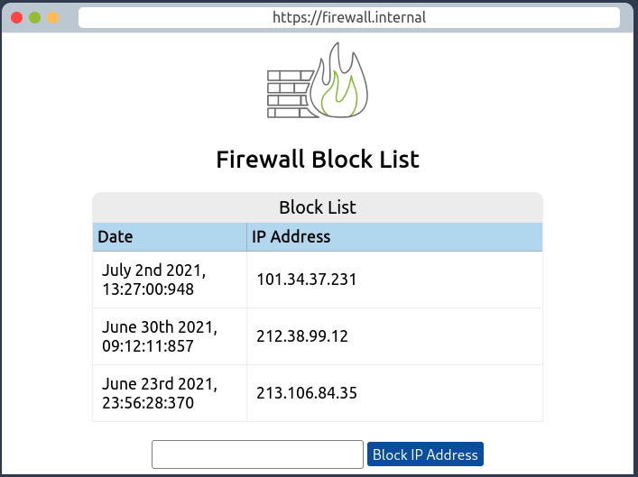

# Intro to Defensive Security

Introducing defensive security and related topics, such as threat intelligence, SOC, DFIR, and SIEM

## Task 1: Introduction to Defensive Security

Offensive security focuses on one thing: breaking into systems. It can be achieved through exploiting bugs, abusing insecure setups, and take advantage of unenforced access control policies ... Red teams and penetration tester specialize in offensive security.

Defensive security is the opposite of offensive:
- Preventing intrusions from occurring
- Detecting intrusions when they occur and responding properly.

`Blue teams` are part of the defensive security landscape.

There are many tasks related to defensive security: `User cyber security awareness, documenting and managing assets, updating and patching systems, setting up preventative security devices (firewall and IPS)`

Some topics:
- **Security Operations Center (SOC)**
- Threat Intelligence
- **Digital Forensics and Incident Response (DFIR)**
- Malware Analysis

## Task 2: Areas of Defensive Security

### Security Operations Center (SOC)

Monitoring the network and its systems to detect malicious cyber security events.

Topics:
- Vulnerabilities
- Policy violations
- Unauthorized activity
- Network intrusions

### Threat Intelligence

In this context, `intelligence` refers to information you gather about actual and potential enemies.

Intelligence needs data. Data has to be collected, processed, and analyzed. 
1. Data collection is done from local sources such as network logs and public sources (forums).
2. Processing of data aims to arrange them into a format suitable for analysis.
3. Analysis phase seeks to find more info about attackers and their motives.

## Digital Forensics and Incident Response (DFIR)

1. Digital Forensics focus on different areas such as: `File System, System memory, System logs, Network logs`
2. Incident Response refers to ***how would you respond to a cyber attack?***. The aim is to reduce damage and recover in the shortest time possible. Ideally, you would develop a plan ready for incident response.

### Malware Analysis

Malware stands for `malicious software`. That includes many types:

- `Virus`: a piece of code that attaches itself to a program, designed to spread from one computer to another, altering, overwriting and deleting files. The result ranges from the computer becoming slow to unusable.
- `Trojan Horse`: a program that shows one desirable function but hides a malicious function underneath.
- `Ransomware`: a malicious program that encrypts the user's files. These files cannot be opened without password. Attacker will offers the user pay money for this password.

## Task 3: Practical Example of Defensive Security

The SOC use SIEM tools (`Security Information and Event Management`) to gather security-related info and events from various sources and presents them via one system.

The malicious IP address maybe 143.110.250.149. It's on the 2rd log. Try clicking it:

Oke, instruction says `there are websites on the Internet that allow you to check the reputation of an IP address to see whether it's malicious or suspicious.`

Now we know the IP address is malicious, we need to escalate it to a staff member!\
You need to escalate this to person who is in charge of your team or department (**SOC Team Lead**).

And then you got the permission to block the malicious IP address on the firewall.

Got the flag?
