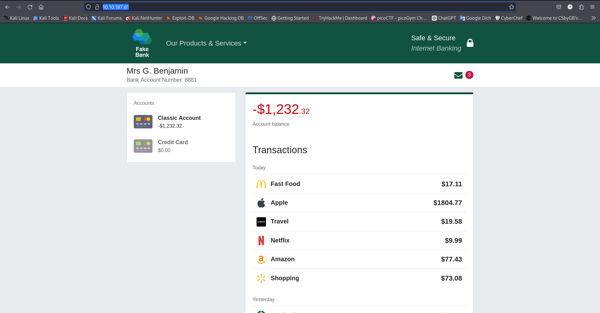
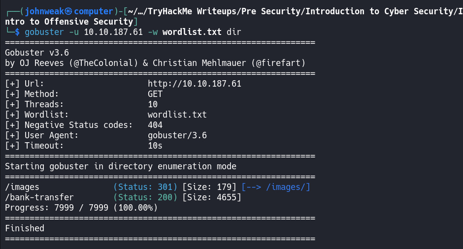
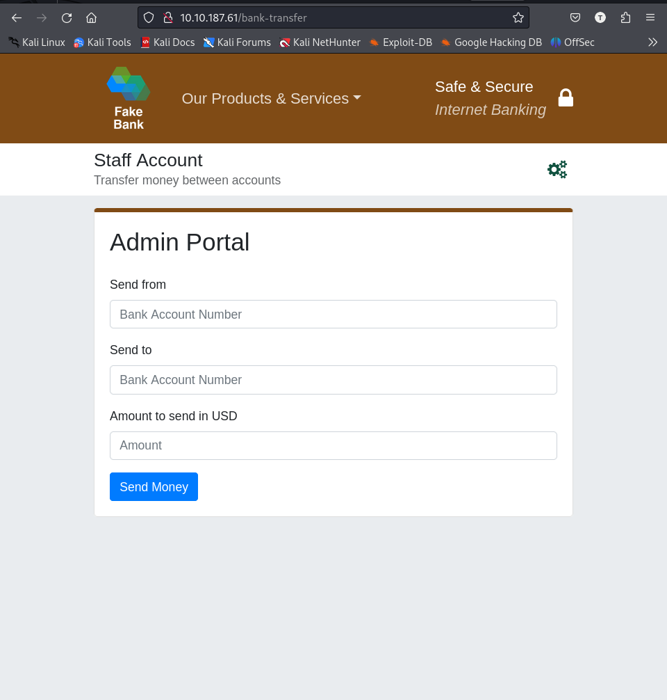
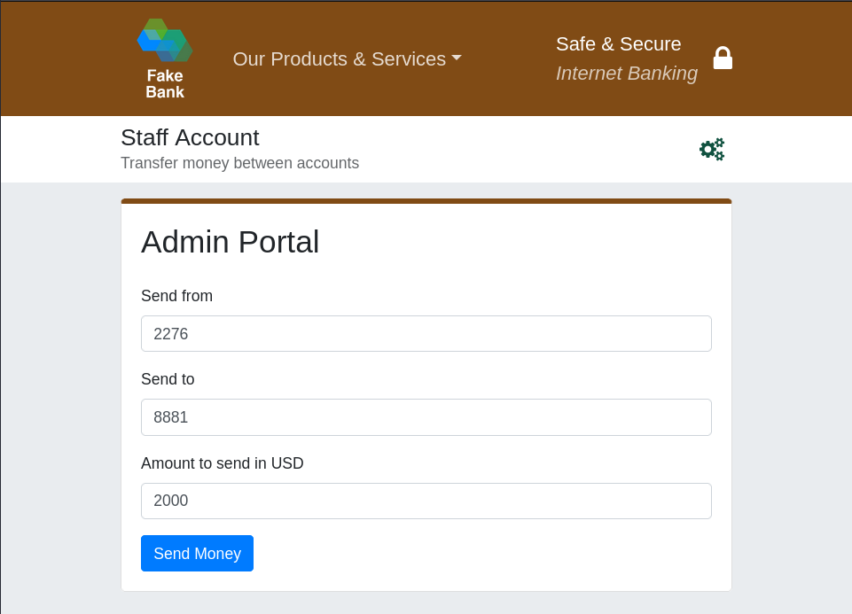
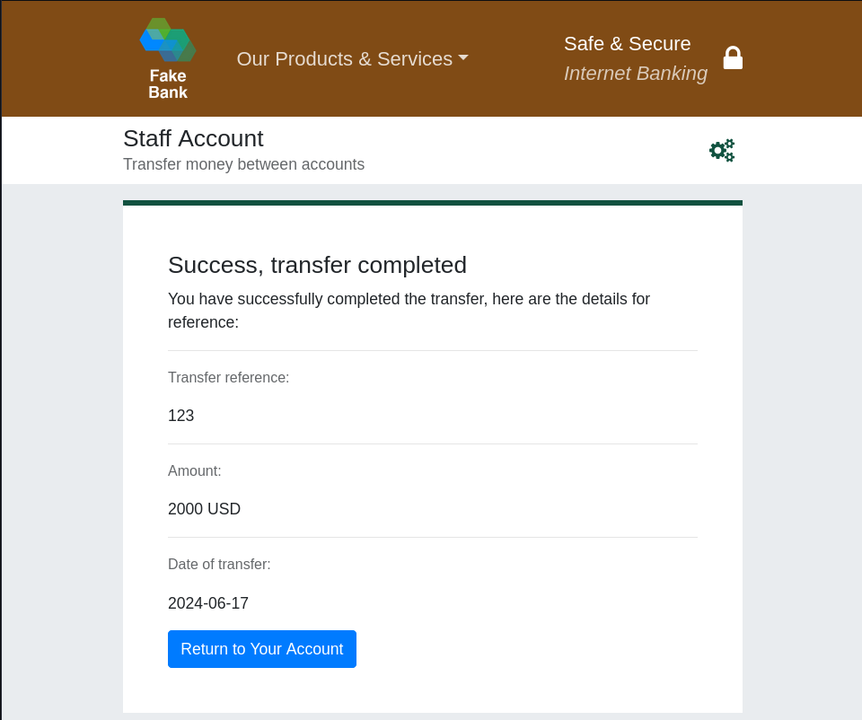
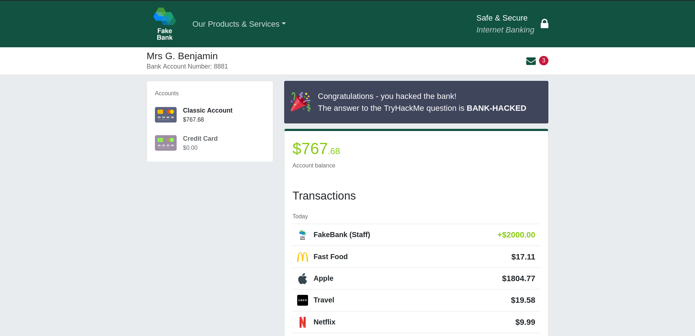

# Intro to Offensive Security
*Hack your first website (legally in a safe environment) and experience an ethical hacker's job.*

## Task 1: What is Offensive Security?
- `Offensive security` is the process of breaking into computer systems, exploiting software bugs, and finding loopholes in apps to **gain unauthorized to access them**.

- To beat a hacker, you need to behave like a hacker.

- On the flip side, `defensive security` is the process of protecting network and computer systems by analyzing and securing any potential digital threats.

## Task 2: Hacking your first machine

Hack a fake bank application called FakeBank.

run openvpn first, copy the target ip address and paste it into serch bar of your local browser.


- `GoBuster` is a command-line application to brute-force a website to find hidden directories and pages. See more info in `man` page.

> Most companies will have an admin portal page, giving their staff access to basic admin controls. Often these pages are not made private allowing attackers to find hidden pages.

i've already prepare the `wordlist.txt` [here](wordlist.txt), just use `wget` to download it in the current directory before run bellow command.

```bash
gobuster -u http://fakebank.com -w wordlist.txt dir
```

Or

```bash
gobuster -u 10.10.187.61 -w wordlist.txt dir
```


we found 2 hidden directories, try the second:



This page which is in admin side, allows hackers to transfer money from a bank account of any customer to them. 

> This page allows an attacker to steal money from any bank account, which is a critical risk for the bank. As an ethical hacker, you would (with permission) find vulnerabilities in their application and report them to the bank to fix before a hacker exploits them

Example: transfer $2000 from the bank account 2276, to your account (account number 8881)





Holy moly. Let's answer the questions.

> If you were a penetration tester or security consultant, this is an exercise you'd perform for companies to test for vulnerabilities in their web apps; find hidden pages to investigate for vulnerabilities.

## Task 3: Careers in cyber security
The cyber careers of offensive security:
1. Penetration Tester - Responsible for testing technology products for finding exploitable security vulnerabilities.
2. Red Teamer - Plays the role of an adversary, attacking an organization and providing feedback from an enemy's perspective
3. Security Engineer - Design, monitor, and maintain security controls, networks and systems to help prevent cyberattacks.