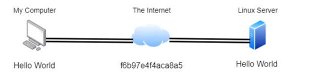
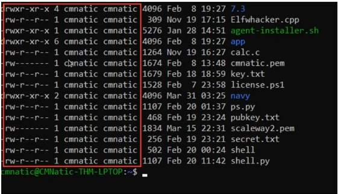
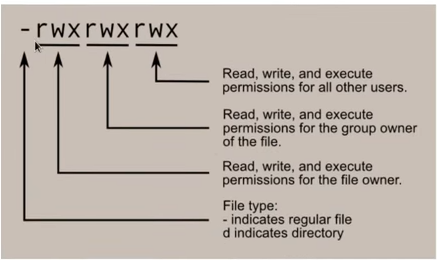
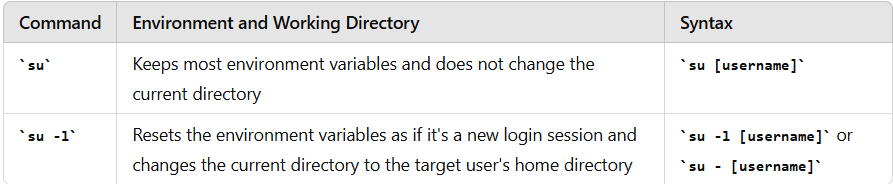

# Linux Fundamentals Part 2

## Accessing Your Linux Machine Using SSH (Deploy)

**What is SSH & how does it work?**

SSH (Secure Shell) simply a protocol between devices in an encrypted form.



- SSH allows us to remotely execute commands on another device remotely.
- Any data sent between the devices is encrypted when it is sent over a network such as the Internet.

**Syntax:**

```bash
$ ssh [username]@[host name or IP address]
```

For example: 

> ssh tryhackme@10.10.137.96

## Using the `man` page

## Some other commands to interact with filesystem

we've covered `ls`, `cd` and `find`, `grep`....

Now we also have:

1. touch
2. mkdir
3. cp
4. mv
5. rm
6. file

Some flags/options : -r, -R, -a, .... 

## Permissions 101

Using `ls -l` to see the long list format of the current directory, which contains some interesting information.



### The column 1 show us the type of it and its permissions 



The first character also could be `l` short for link. It means this file/directory is a symbolic link or symlink. It references to another file/directory.

### The column 2 is the number of link that references to it

### The column 3 means the user who owns it

### The column 4 means the group who owns it

### The column 5 it the size (in byte)

...


## Switch between users

```bash
$ su [user]
```



## Common Directories

1. `/etc`: store system files that are used by your OS, short for etcetera.
2. `/var`: store data that is frequently accessed, short for variable data
3. `/root`: unlike `/home`, `/root` actually is the home of **root** system user.
4. `/tmp`: store data that is only needed to be accessed once or twice, short for temporary. Once your computer is restarted, the contents within this dir are cleared out.
