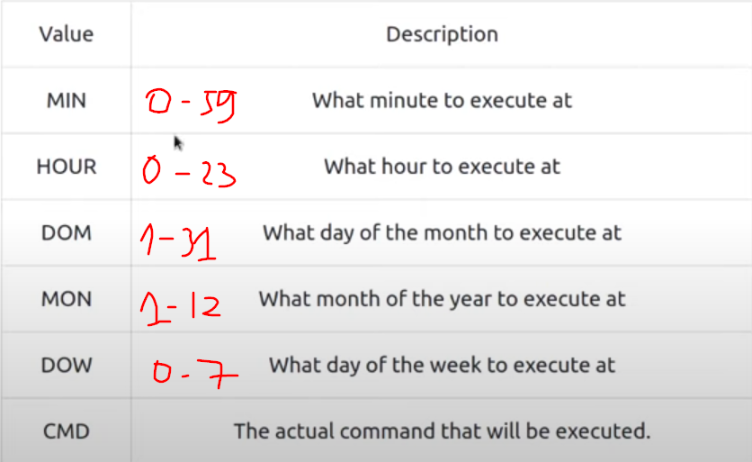

# Linux Fundamentals Part 3

## Terminal Text Editors

1. Nano
2. Vim

## General/Useful Utilities

1. Downloading files using `wget`. This command allows us to download files from the web via HTTP
2. Transferring files from your host using `scp` (SSH)
    **Syntax:** 

    ```bash
    $ scp [src] [dest]
    ```

    For example: `scp src.txt ubuntu@192.168.1.20:/home/ubuntu/dest.txt` to upload the file `src.txt` at local machine to `dest.txt` at remote machine.

    Or: `scp ubuntu@192.168.1.20:/home/ubuntu/dest.txt copy.txt` to download the file `dest.txt` from remote machine to `copy.txt` at local machine. 
3. python3

## Processes 101

+ Viewing processes by using the command `ps`. And to see the processes run by other users, we can use `ps aux`. Another command is useful is `top` command, it will show us real-time statistics about the processes running on our system instead of a one-time view, refreshing every 10 s.
+ Kill a process by PID: `$ kill 1337`
  There are some of the signals that we can send to a process when it is killed:
  + **SIGTERM**: kill but allow it to do some cleanup tasks beforehand
  + **SIGKILL**: kill - doesn't do any cleanup after the fact
  + **SIGSTOP**: stop/suspend a process

### How do processes start? 

namespace to split resource for each process (this resource is isolating)

google to understand more.

### Getting Processes/Services to Start on Boot

```bash
$ systemctl [option] [service]
```

We have some options: 
+ start
+ stop
+ enable
+ disable
+ restart
+ status
....

### An intro to backgrounding and foregrounding in Linux

Processes can run in 2 states: in background (by adding `&` operator) and in foreground (by default).

An other way to change a foreground process into background process is to use `Ctrl + Z`. We use this way when we have a loop (maybe).

And we can use `fg` to bring this back to focus (bring the background process back into use on the terminal).

## Maintaining your system: automation

Scheduling a certain task to take place after the system has booted by using `cron` process.

We can interact with it via the use of `crontabs`. A crontab requires 6 values:



for example:

```bash
0 * 12 * * * cp -R /home/cmnatic/Documents /var/backups
```

To edit `crontab` file, we use: `$ crontab -e`

## Maintaining your system: packet management

using `apt`, `dpkg`

`apt update && apt upgrade -y`

`apt install [software]`

`apt remove [software]`


## Maintaining your system: logs

in directory `/var/log` 